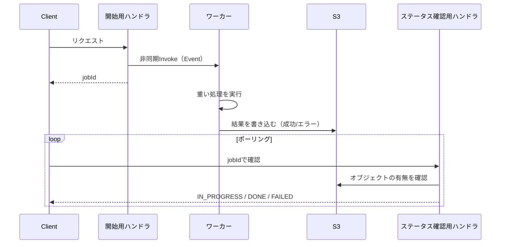

# 非同期ジョブ「開始→ポーリング」パターン

API Gatewayの統合タイムアウト（29秒固定、変更不可）を超える重い処理（ヘッドレスChromiumでのPDFレンダリング、音声認識等）を、APIリクエストとは別の実行単位へ委譲するためのパターンをまとめる。karuta（`bamiyanapp/karuta`）での実装（PDF生成・音声認識の2箇所で独立に出現）を一般化したものである。

## 全体構成

3つのLambda関数（または同等の処理単位）で構成する。

1. **開始用ハンドラ**: APIリクエストを受け付け、jobIdを発行する。重い処理本体はワーカーへ非同期委譲し、即座にjobIdを返す
2. **ワーカー**: 実際の重い処理を実行し、結果（成功時の出力、失敗時のエラー内容）をS3へ書き込む。API Gateway経由では呼ばれない
3. **ステータス確認用ハンドラ**: jobIdを受け取り、S3上の成功/エラーオブジェクトの有無から都度ステータスを導出する。専用の状態保存テーブルは持たない（ステートレス）



<details><summary>Mermaidソース（レンダリング済み画像は上記）</summary>

上記と同じソースを折りたたんで保持する。GitHubのPR差分ビュー等でソースのまま表示されるのを避けるため（[`documentation-format-conventions.md`](documentation-format-conventions.md)参照）。

</details>

## 開始用ハンドラ

```js
const { LambdaClient, InvokeCommand } = require("@aws-sdk/client-lambda");
const crypto = require("crypto");

const lambdaClient = new LambdaClient({ region: "<region>" });

exports.startJob = async (event) => {
  const jobId = crypto.randomUUID();

  // InvocationType: "Event"は必ずawaitする。awaitしないとこの関数のPromiseが
  // 解決した直後にLambdaの実行環境が凍結され、送信中のSDK呼び出し
  // （InvokeCommand送信自体）が破棄される恐れがある
  await lambdaClient.send(new InvokeCommand({
    FunctionName: process.env.WORKER_FUNCTION_NAME,
    InvocationType: "Event",
    Payload: JSON.stringify({ jobId, /* ワーカーへ渡す入力 */ }),
  }));

  return jsonResponse(200, { jobId });
};
```

## ワーカー

```js
const { S3Client, PutObjectCommand } = require("@aws-sdk/client-s3");

const s3Client = new S3Client({ region: "<region>" });
const resultObjectKey = (jobId) => `<job-prefix>/${jobId}.json`;
const errorObjectKey = (jobId) => `<job-prefix>/${jobId}.error.json`;

// API Gateway経由ではなく、startJobからの非同期Invokeでのみ呼ばれる
// （httpイベントを設定していないため、eventはpayloadそのもの）
exports.runWorker = async (event) => {
  const { jobId } = event;
  try {
    const result = await /* 重い処理本体 */;

    await s3Client.send(new PutObjectCommand({
      Bucket: process.env.JOB_RESULT_BUCKET_NAME,
      Key: resultObjectKey(jobId),
      Body: JSON.stringify(result),
      ContentType: "application/json",
    }));
  } catch (error) {
    console.error(error);
    try {
      await s3Client.send(new PutObjectCommand({
        Bucket: process.env.JOB_RESULT_BUCKET_NAME,
        Key: errorObjectKey(jobId),
        Body: JSON.stringify({ message: error.message }),
        ContentType: "application/json",
      }));
    } catch (writeError) {
      console.error("Failed to write error marker", writeError);
    }
  }
};
```

## ステータス確認用ハンドラ

```js
const { S3Client, HeadObjectCommand, GetObjectCommand } = require("@aws-sdk/client-s3");

const s3Client = new S3Client({ region: "<region>" });
const isNotFoundError = (error) =>
  error.name === "NotFound" || error.name === "NoSuchKey" || error.$metadata?.httpStatusCode === 404;

// ジョブの状態はDynamoDB等に保存せず、S3上の実際のオブジェクトの有無から
// 都度導出する（「状態を持たずライブに確認する」方針）
exports.getJobStatus = async (event) => {
  const { jobId } = event.queryStringParameters || {};
  if (!jobId) return badRequest("Invalid input");

  try {
    await s3Client.send(new HeadObjectCommand({
      Bucket: process.env.JOB_RESULT_BUCKET_NAME,
      Key: resultObjectKey(jobId),
    }));
    // 必要であれば署名付きURL（getSignedUrl）を発行してレスポンスへ含める
    return jsonResponse(200, { status: "DONE" });
  } catch (headError) {
    if (!isNotFoundError(headError)) throw headError;
  }

  try {
    const errorObject = await s3Client.send(new GetObjectCommand({
      Bucket: process.env.JOB_RESULT_BUCKET_NAME,
      Key: errorObjectKey(jobId),
    }));
    const parsedError = JSON.parse(await streamToBuffer(errorObject.Body));
    return jsonResponse(200, { status: "FAILED", message: parsedError.message });
  } catch (getError) {
    if (!isNotFoundError(getError)) throw getError;
  }

  return jsonResponse(200, { status: "IN_PROGRESS" });
};
```

## 設計上の判断

- **状態保存先をDynamoDBではなくS3オブジェクトの有無にした理由**: 専用のジョブテーブル・TTL設定・レコード削除処理が不要になる。結果がDynamoDBの1アイテム400KB上限を超える可能性がある場合（PDF等のバイナリ、大きめのJSON）にもそのまま対応できる。欠点は、ジョブ一覧の取得（Scan相当）やキャンセル状態の管理には向かない点である。そのような要件がある場合はDynamoDB等の専用テーブルを検討する
- **`InvocationType: "Event"`の呼び出しは必ず`await`する**。Lambdaの実行モデルでは、ハンドラのPromiseが解決すると実行環境が即座に凍結されうる。`await`せずに`InvokeCommand`の送信を開始した直後にハンドラが返ると、送信中のSDK呼び出し自体が完了せず、ワーカーが起動しないことがある
- **サーバー側でも入力の上限チェックを行う**。クライアント側でUIが入力数等を制限していても、API直叩きで迂回できる。サーバー側で実際のデータ量を数え直し、無制限に重いワーカーを起動できないようにする
- ワーカーのメモリサイズ・タイムアウトはデプロイ設定側（`serverless.yml`の`provider.memorySize`/`timeout`）で、処理内容に応じて開始用ハンドラより大きく設定する

## 必要なIAM権限・デプロイ設定

- 開始用ハンドラの実行ロールに`lambda:InvokeFunction`（対象はワーカー関数のARNに限定）を付与する。他の関数を非同期起動する権限は、循環参照を避けるため当該関数専用のIAMロールへ分離する
- ワーカー・ステータス確認用ハンドラの実行ロールに、結果格納用S3バケットへの`s3:PutObject`（ワーカー）・`s3:GetObject`/`s3:HeadObject`（ステータス確認用）を付与する
- ヘッドレスChromium等、重量のあるネイティブ依存を使う場合は`custom.esbuild.external`（[`serverless-spa-pattern.md`](serverless-spa-pattern.md)参照）でバンドル対象から除外し、実体ファイルのまま含める

## 参考実装

karuta（`bamiyanapp/karuta`）の`backend/efudaPdfHandler.js`（`generateEfudaPdf`・`renderEfudaPdfWorker`・`getEfudaPdfStatus`）が本パターンの実装例である。音声認識機能（`startSpeechRecognition`・`getSpeechRecognitionResult`）も同じ構成で独立に実装されている。
