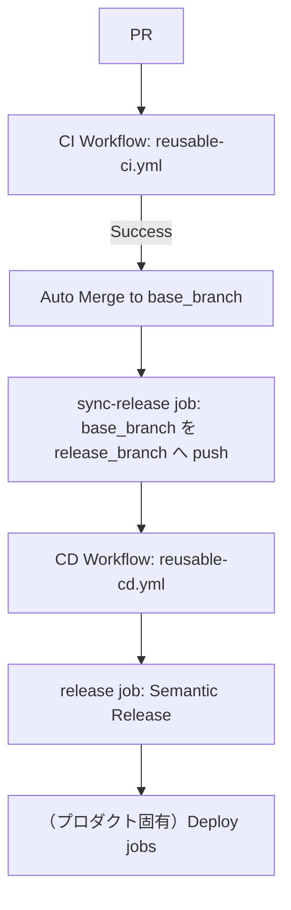

# CI/CD Pipeline Specification（共通）

本ドキュメントは `.github/workflows/reusable-ci.yml` / `reusable-cd.yml` が提供する共通 CI/CD パイプラインの仕様を示す。

frontend/backend のビルド・デプロイ手順（デプロイ先、固有の環境変数など）はプロダクトごとに異なるため対象外であり、参照側リポジトリの `docs/cicd-pipeline-specification.md` に記載する。

## Architecture

## 1. CI ワークフロー (`reusable-ci.yml`)
- **トリガー**: 参照側 `ci.yml` の `on` 設定に従う（通常 `base_branch` へのプッシュ、全プルリクエスト）
- **実行内容**:
  - `commitlint`: コミットメッセージが Conventional Commits 形式に従っているか検証
  - `frontend-test`: frontend の Lint・Vitest テスト・ビルド
  - `backend-test`: backend の Lint・Vitest テスト
  - `frontend-e2e-test`（任意、`enable_e2e_test: true` の場合のみ）: Playwright による E2E テスト
  - `merge`: PR の場合、テスト成功後に `base_branch` へ自動マージ（Squash merge、作業ブランチ削除）
  - `sync-release`（任意、`enable_release_sync: true` の場合のみ）: `merge` 完了後、`base_branch` の最新コミットを `release_branch` へマージ＆プッシュ（この push が CD ワークフローのトリガーとなる）

入力パラメータ（`frontend_dir` / `backend_dir` / `node_version` / `workspaces` / `enable_e2e_test` / `enable_release_sync` / `base_branch` / `release_branch` / `sync_branch_prefix` / `merge_ours_paths`）は README.md を参照。

## 2. CD ワークフロー (`reusable-cd.yml`)
- **トリガー**: 参照側 `cd.yml` の `on` 設定に従う（通常 `release_branch` へのプッシュのみ）
- **実行内容**:
  - `release`: `release_branch` を `base_branch` に追従させたうえで `semantic-release` を実行し、バージョン自動採番・タグ付け・`CHANGELOG.md` 更新を行う
  - リリース発行時（出力 `new_release_published == 'true'`）は `release_branch` → `base_branch` の同期 PR を作成し、自動マージする
  - frontend/backend のビルド・デプロイ（GitHub Pages・AWS Lambda 等）はプロダクトごとに異なるため対象外。参照側リポジトリの `cd.yml` に `needs: release` かつ `if: success() && needs.release.outputs.new_release_published == 'true'` の条件でジョブを追加する

入力パラメータ（`node_version` / `base_branch` / `release_branch` / `sync_branch_prefix` / `merge_ours_paths`）は README.md を参照。

## 3. リリース運用
- **リリース条件**: `semantic-release` による実際のタグ付けとデプロイは、**`release_branch` へのマージ（プッシュ）時にのみ**実行される。
  - `base_branch` は開発用であり、保護設定による権限エラーを避けるため、自動リリースはスキップされる。
- **リリースの手順**:
  1. 通常の開発は `base_branch` に対して行い、PR を作成してマージする。
  2. リリースの準備ができたら、`base_branch` を `release_branch` にマージする。
  3. `release_branch` での CI 成功後、自動的にリリースおよびデプロイが行われる。

## 共通の環境変数
| 変数名 | 説明 |
|---|---|
| `GITHUB_TOKEN` | GitHub Actions が自動的に提供するトークン。`BOT_TOKEN` 未設定時のフォールバックとして使用される |
| `BOT_TOKEN` | `release_branch`⇄`base_branch` の自動同期コミット・PR作成、および `semantic-release` 実行時の push 権限確保に使用されるボット用トークン（任意。未設定時は `GITHUB_TOKEN` にフォールバック） |

プロダクト固有の環境変数（デプロイ先の認証情報など）は参照側リポジトリのドキュメントに記載する。

---

# Release → base_branch 自動同期 PR（CI スキップ運用）について

`reusable-ci.yml` / `reusable-cd.yml` を採用するリポジトリでは、`release_branch` と `base_branch` の差分を
**GitHub Actions により自動で Pull Request 作成 → 自動マージ** している。

この PR は **コードレビューや CI を目的としない「同期専用 PR」** である。

そのため、通常の開発 PR とは異なるブランチ保護ルールが必要になる。

---

## 目的

- `release_branch` でのリリース作業を `base_branch` に安全に反映する
- semantic-release によるタグ管理を壊さない
- CI を走らせずに即時マージする
- Bot による完全自動運用を可能にする

---

## 前提

- `release_branch` → `base_branch` の PR は **GitHub Actions（Bot）** が作成
- 人間によるレビュー・修正は想定しない
- CI が不要、または `[skip ci]` が付与される

---

## 1. Auto-merge を有効化

**Settings → General → Pull Requests**

- ✅ Allow auto-merge

---
## GitHub Branch Protection Rules (`base_branch`)

**Settings → Rules → Rulesets**

`base_branch` に対して、以下のルールを設定する。

---

### 1. Pull Request マージの必須化

✅ **ON**

> `base_branch` への直接 push を防ぎ、必ず PR 経由にする

---

### 2. レビュー関連（すべて OFF）

| 項目 | 設定 |
|---|---|
| Required approvals | **0** |
| Dismiss stale pull request approvals | OFF |
| Require review from specific teams | OFF |
| Require review from Code Owners | OFF |
| Require approval of the most recent reviewable push | OFF |
| Require conversation resolution before merging | OFF |

#### 理由

- Bot PR に人間レビューを要求すると **自動マージ不能**
- 同期目的のためレビュー自体が不要

---

### 3. ステータスチェック（CI）

❌ **Require status checks to pass** → OFF

#### 理由

- 同期 PR は CI を目的としない
- CI が存在しない / skip されるケースを許容するため

---

### 4. マージ方法の許可

✅ **Allow squash merging（推奨）**

❌ Allow merge commits
❌ Allow rebase merging

#### 理由

- `base_branch` に不要な履歴を残さない
- 「同期」という意図が 1 コミットで明確になる
- semantic-release の解析が安定する

---

### 5. バイパスリスト（重要）

#### 推奨設定

以下のいずれかを **Bypass list** に追加する。

- `github-actions[bot]`
- または 使用している GitHub App / Bot

#### 理由

- ブランチ制限を Bot が回避できないと PR 作成・マージに失敗する
