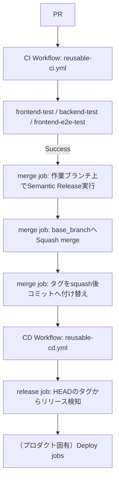

# CI/CD Pipeline Specification（共通）

本ドキュメントは `.github/workflows/reusable-ci.yml` / `reusable-cd.yml` が提供する共通 CI/CD パイプラインの仕様を示す。

frontend/backend のビルド・デプロイ手順（デプロイ先、固有の環境変数など）はプロダクトごとに異なるため対象外であり、参照側リポジトリの `docs/cicd-pipeline-specification.md` に記載する。

## Architecture

## 1. CI ワークフロー (`reusable-ci.yml`)
- **トリガー**: 参照側 `ci.yml` の `on` 設定に従う（通常 `base_branch` へのプッシュ、全プルリクエスト）
- **実行内容**:
  - `commitlint`: コミットメッセージが Conventional Commits 形式に従っているか検証
  - `frontend-test`: frontend の Lint・Vitest テスト・ビルド
  - `backend-test`: backend の Lint・Vitest テスト
  - `frontend-e2e-test`（任意、`enable_e2e_test: true` の場合のみ）: Playwright による E2E テスト
  - `merge`: PR の場合、テスト成功後に以下を**1つのジョブ内で直列に**実行する
    1. （`enable_release: true` の場合）PR の作業ブランチに `base_branch` の最新コミットを取り込んだうえで、その作業ブランチ上で直接 `semantic-release`（`--no-ci --branches <作業ブランチ名>`）を実行し、バージョン自動採番・`CHANGELOG.md` 更新・タグ付けを行う
    2. `base_branch` へ自動マージ（Squash merge、作業ブランチ削除）
    3. リリースが発行されていた場合、squash merge によって生成された新しいコミットへ tag と GitHub Release の `target_commitish` を付け替える（squash merge はコミットを作り変えるため、作業ブランチ上で打ったタグはそのままでは `base_branch` の祖先ではなくなる）
  - このジョブは **`merge-queue-<repository>` という固定名の `concurrency` グループで直列化**されており、複数 PR が同時にマージされてもバージョン計算が競合しない（順番待ちであり、キャンセルはされない）

入力パラメータ（`frontend_dir` / `backend_dir` / `node_version` / `workspaces` / `enable_e2e_test` / `enable_release` / `base_branch` / `enable_changelog_json` / `changelog_source_path` / `changelog_json_output_path`）は README.md を参照。

## 2. CD ワークフロー (`reusable-cd.yml`)
- **トリガー**: 参照側 `cd.yml` の `on` 設定に従う（通常 `base_branch` へのプッシュ）
- **実行内容**:
  - `release`: HEAD コミットに `vX.Y.Z` 形式のタグが付いているかどうかを見るだけで、新規リリースかどうかを判定する（バージョン計算・タグ付け自体は `reusable-ci.yml` の `merge` job がマージ前に完了させている）
  - frontend/backend のビルド・デプロイ（GitHub Pages・AWS Lambda 等）はプロダクトごとに異なるため対象外。参照側リポジトリの `cd.yml` に `needs: release` かつ `if: success() && needs.release.outputs.new_release_published == 'true'` の条件でジョブを追加する

## 3. リリース運用
- **リリース条件**: PR の作業ブランチ上で `semantic-release` を実行した結果、リリース対象のコミット（`feat`/`fix` 等）が含まれる場合にのみバージョンが発行される。
- **リリースの手順**:
  1. 通常どおり PR を作成する。
  2. CI（テスト）成功後、`merge` job がマージ前にバージョンを計算・コミットし、`base_branch` へ squash merge する。
  3. squash merge 後のコミットにタグが付け替えられ、その push が CD ワークフローをトリガーし、デプロイが行われる。
- **なぜマージ前に作業ブランチで実行するのか**: 従来は `release_branch` へのマージ後に `semantic-release` を実行し、`base_branch` へ同期 PR で戻す方式だったが、`release_branch` の維持コストと往復の複雑さを解消するため、バージョン確定を PR マージ前に前倒しした。
- **`base_branch` への直接 push が不要な理由**: バージョン更新コミットは PR の作業ブランチ（保護されていない）へ push され、`base_branch` へは通常の PR マージ（Squash merge の GitHub API 呼び出し）で反映されるため、`base_branch` のブランチ保護（PR 必須化）を維持したまま運用できる。

## 4. 直列化（マージキュー）についての注意
- 複数 PR が同時に開いていると、それぞれが同じ「次バージョン」を計算してしまう競合が起こり得る（`package.json` の version フィールドは両者が同じ値に変更するため、git の3-wayマージでは**コンフリクトとして検出されない**ことがある）。
- そのため `merge` job 全体（バージョン計算・コミット・push・squash merge・タグ付け替えまで）を `concurrency: group: merge-queue-<repository>, cancel-in-progress: false` で直列化し、必ず1PRずつ最新の `base_branch` を取り込んでからバージョンを計算する。

## 共通の環境変数
| 変数名 | 説明 |
|---|---|
| `GITHUB_TOKEN` | GitHub Actions が自動的に提供するトークン。`merge` job のバージョン更新コミットの push に使う（このトークンによる push は他の workflow をトリガーしないため、PR の CI が再実行されない） |
| `BOT_TOKEN` | `merge` job での実際の PR マージ（squash merge API 呼び出し）に使用するボット用トークン（任意。未設定時は `GITHUB_TOKEN` にフォールバック）。**`base_branch` への push が CD ワークフローのトリガーとなるため、`GITHUB_TOKEN` による push ではCDが起動しない点に注意**（`GITHUB_TOKEN` によるイベントは新たな workflow 実行を作らないため）。`enable_release: true` で運用する場合は `BOT_TOKEN` の設定を推奨する |

プロダクト固有の環境変数（デプロイ先の認証情報など）は参照側リポジトリのドキュメントに記載する。
