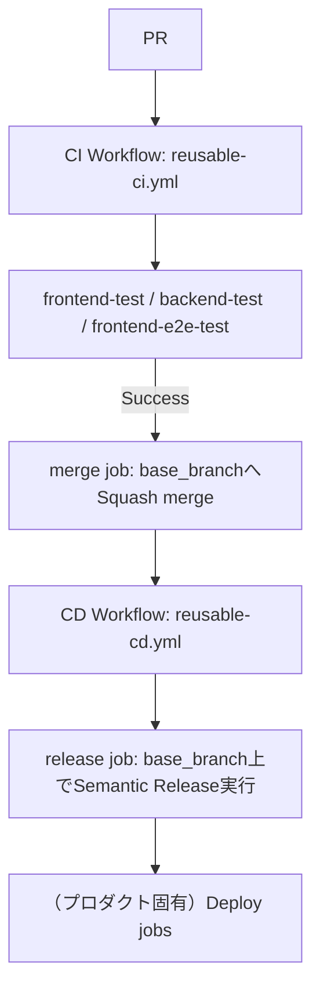

# CI/CD Pipeline Specification（共通）

本ドキュメントは `.github/workflows/reusable-ci.yml` / `reusable-cd.yml` が提供する共通 CI/CD パイプラインの仕様を示す。

frontend/backend のビルド・デプロイ手順（デプロイ先、固有の環境変数など）はプロダクトごとに異なるため対象外であり、参照側リポジトリの `docs/cicd-pipeline-specification.md` に記載する。

## Architecture



## 1. CI ワークフロー (`reusable-ci.yml`)
- **トリガー**: 参照側 `ci.yml` の `on` 設定に従う（通常 `base_branch` へのプッシュ、全プルリクエスト）
- **実行内容**:
  - `commitlint`: コミットメッセージが Conventional Commits 形式に従っているか検証
  - `frontend-test`: frontend の Lint・Vitest テスト（カバレッジ集計付き）・ビルド
  - `backend-test`: backend の Lint・Vitest テスト（カバレッジ集計付き）
  - `package-test`（`packages` 入力指定時、`frontend-test`/`backend-test` の代わりに実行）: 指定したパッケージ一覧を `strategy.matrix` で展開し、lint/test（`--if-present`）・任意のbuildを行う
  - 上記いずれのテストjobも、`coverage_threshold`（グローバルまたは `packages` 内の要素ごと）が0より大きい場合のみ「Check coverage threshold」ステップを実行し、`check-coverage-threshold` 複合アクションで `coverage/coverage-summary.json` を読み、Job Summaryへのカバレッジ表表示と閾値未満の指標があった場合のジョブ失敗を行う。閾値が0（既定）の場合はこのステップ自体を実行しない。

    この複合アクションをどう参照するかについては、3段階の失敗を経て現在の実装に至っている（詳細は[bamiyanapp/karuta#583](https://github.com/bamiyanapp/karuta/issues/583)）。
    - **失敗1**: 当初は相対パス（`uses: ./.github/actions/check-coverage-threshold`）で参照していたが、**ステップレベルの`uses: ./path`は常に呼び出し元リポジトリ（このジョブでCheckoutした対象）のチェックアウト内容に対して解決される**（reusable-ci.yml自身のrefには解決されない）ため、dev-standards自身のdogfooding CI（呼び出し元と定義元が同一リポジトリ）でしか正しく動作しない不具合だった。`coverage_threshold`が0（既定）のジョブでは該当ステップ自体が実行されないため潜在化していたが、常時実行される`frontend-e2e-test`の「Show E2E coverage」ステップで顕在化した
    - **失敗2**: `uses: bamiyanapp/dev-standards/.github/actions/check-coverage-threshold@<ref>`という完全修飾（owner/repo/path@ref）形式に変更し、`<ref>`を直前のステップの出力（`steps.dev-standards-ref.outputs.ref`）から動的に渡す実装を一度リリースしたが、**`uses:`フィールドはsteps contextを参照できず、ジョブ計画時に静的に解決可能な値でなければならない**というGitHub Actionsの制約に反しており、該当ジョブが1つも作成されないまま即座に失敗する（startup failure）という、失敗1よりも深刻な状態（CIが実質的に完全停止）を引き起こした
    - **失敗3**: 失敗2を受け、`actions/checkout@v7`（`with:`はsteps contextを問題なく参照できる）で「このワークフロー自身と同じref」のdev-standardsを`.dev-standards-actions/`へcheckoutし、`uses:`は常に静的な相対パス文字列のみにする案に切り替えたが、そのrefを`GITHUB_WORKFLOW_REF`環境変数から導出する実装も誤りだった。**`GITHUB_WORKFLOW_REF`は、このreusable workflow自身のrefではなく、呼び出し元（karuta等）のトップレベルワークフロー自身のref（PRのマージref`refs/pull/<PR番号>/merge`等）を返す**ため、dev-standardsに存在しないrefをcheckoutしようとして失敗した
    - **現在の実装**: 動的なrefの取得を諦め、`actions/checkout@v7`の`ref:`にdev-standardsの固定タグ（例: `v1.2.2`）を直接指定する。dev-standardsの新しいリリースのたびに、この参照タグを手動で最新へ更新する必要がある（更新を忘れても、check-coverage-threshold自体の内容が変わらない限り実害はない）。3度の失敗を踏まえた教訓: **ライブでしか検証できないGitHub Actionsの挙動について、動的な値の解決を試みるのは避け、可能な限り静的な固定値を使うこと**
  - `frontend-e2e-test`（任意、`enable_e2e_test: true` の場合のみ）: Playwright による E2E テスト

    E2Eテストがスクリーンショットを撮影している場合（後述の呼び出し規約に従い`<frontend_dir>/e2e-screenshots/`へPNGを書き出している場合）、このjobは追加で次を行う（開発環境の制約「スマホオンリー」対応、[bamiyanapp/karuta#568](https://github.com/bamiyanapp/karuta/issues/568)）。

    1. `e2e-screenshots/*.png`の存在を確認する（無ければ以降のステップはスキップ）
    2. `pull_request`イベントの場合、GitHub API（`pulls.listFiles`）でそのPRの変更ファイル一覧を取得し`<frontend_dir>/changed-files.json`へ書き出す（`continue-on-error: true`。取得できない場合やイベントが`pull_request`以外の場合は後述の関連判定が常にフォールバックする）
    3. `peaceiris/actions-gh-pages`で`e2e-screenshots`ブランチの`runs/<run_id>/`配下へPNGを公開する（`continue-on-error: true`。このステップの失敗がE2Eテスト自体の成否判定を上書きしてはならないため）
    4. 公開したPNGを`raw.githubusercontent.com`のURLとして埋め込んだMarkdownを組み立て、Job Summaryへ出力する。見出しには、同名の`<name>.caption.txt`（呼び出し側が任意で書き出すUTF-8プレーンテキスト）があればその内容を、無ければファイル名（`<name>`）をそのまま使う。さらに、同名の`<name>.spec.txt`（撮影したスペックファイル名）・`<name>.title.txt`（撮影したテストケース名）と`<frontend_dir>/e2e/spec-source-map.json`（検証対象ソースパスの宣言）の両方が用意されており、かつ手順2で変更ファイル一覧が取得できている場合は、その宣言パスと変更ファイル一覧を突き合わせ、重なりが無ければ`<details><summary>`で折りたたむ（[bamiyanapp/karuta#628](https://github.com/bamiyanapp/karuta/issues/628)、案A。グルーピング・宣言の単位をテストケース単位まで細かくした経緯は[bamiyanapp/karuta#651](https://github.com/bamiyanapp/karuta/issues/651)）。判定材料のいずれかが欠けている場合は、無関係と誤判定して見落とすことを避けるため常に展開表示にフォールバックする
    5. `pull_request`イベントの場合、上記MarkdownをPRコメントとして投稿する

    Playwright HTMLレポート（アーティファクトzip）だけでは、特にスマートフォン版GitHubアプリからのダウンロード・展開が事実上できず閲覧しづらい。この仕組みにより、E2Eテストの視覚的な結果をJob Summary・PRコメント上で画像として直接確認でき、スマートフォンのブラウザ操作だけで完結する（CLAUDE.md「開発環境の制約（スマホオンリー）」参照）。

    **参照側リポジトリでの呼び出し規約**: `<frontend_dir>/e2e-screenshots/<name>.png`へPNGを書き出すヘルパー関数（例: karutaの`frontend/e2e/screenshot.js`の`captureScreenshot(page, testInfo, name, caption)`）を各プロダクトのE2Eテストコード側に用意する。`caption`（第4引数、任意）を渡した場合は同名の`<name>.caption.txt`も書き出し、Job Summary・PRコメントの見出しに日本語等の説明文を使えるようにする。`name`自体は`raw.githubusercontent.com`のURLの一部になるため、英数字のみのASCII安全な識別子にすること（日本語等の非ASCII文字を含めるとURLエンコードの問題が起き得るため、キャプションとして分離する）。

    **関連スクリーンショットの折りたたみ判定（任意、オプトイン）**: テストケース・スクリーンショット数が増えるとPRコメント・Job Summaryが常に全展開の状態で見にくくなるため、以下の2つを両方用意した場合にのみ、そのPRの変更と無関係なグループを自動的に折りたたむ。
    - 呼び出し側のヘルパー関数が、撮影に使ったスペックファイル名（Playwrightの`testInfo.file`から自動取得できる。呼び出し側の追加対応は不要）を同名の`<name>.spec.txt`として書き出す。加えて、撮影したテストケース名（`testInfo.title`）を同名の`<name>.title.txt`として書き出していれば、グループ化の単位はスペックファイル単位ではなく**テストケース単位**（`<spec>::<title>`）になる（[bamiyanapp/karuta#651](https://github.com/bamiyanapp/karuta/issues/651)）。`<name>.title.txt`が無い場合は従来どおりスペックファイル単位に留まる（後方互換）
    - `<frontend_dir>/e2e/spec-source-map.json`に検証対象ソースパス（リポジトリルート相対）を宣言する。値が配列の場合はスペックファイル単位の宣言（従来形式、例: `{"quiz-room.spec.js": ["frontend/src/views/QuizRoomView.jsx", ...]}`）、値がオブジェクトの場合はテストケース名をキーとするテストケース単位の宣言（例: `{"quiz-room.spec.js": {"admin judges a buzz": ["backend/quizRoomHandler.js"]}}`）として扱う。`<name>.title.txt`が無いスクリーンショットには後者の宣言は適用されない（宣言なしとして扱われ、常に展開表示にフォールバックする）

    この2つのいずれか、または変更ファイル一覧の取得（`pull_request`イベントでの実行）のいずれかが欠けている場合は、その旨を機械的に判定する材料が無いため、常に展開表示にフォールバックする（既存の呼び出し側に影響を与えない後方互換動作）。

    このヘルパー関数自体は現時点でdev-standards側の共有アセットとしては提供していない（各プロダクトが上記の書き出し規約に従って個別に実装する）。将来、複数プロダクトでの採用が進み共有ユーティリティとして切り出す場合は、6節で述べる`reusable-ci.yml`/`reusable-cd.yml`のバージョン固定と同じ規律（固定タグ参照・Renovateによる更新PR・参照側リポジトリ自身のCIをゲートにした明示的なバージョン引き上げ）を最初から適用し、あるプロダクト向けの変更が他プロダクトへ無自覚に波及しないようにすること。
  - `merge`（`enable_auto_merge: true`（デフォルト）の場合のみ）: PR の場合、テスト成功後に `base_branch` へ自動マージ（Squash merge、作業ブランチ削除）する。バージョン計算・タグ付け・GitHub Release作成は行わない（`reusable-cd.yml` 側に移動、後述）
  - このジョブは **`merge-queue-<repository>` という固定名の `concurrency` グループで直列化**されており、複数 PR が同時にマージされても順番に処理される（キャンセルはされない）
  - `enable_auto_merge: false` を指定すると `merge` job がスキップされ、CI チェックのみを行う。マージは人手で行う必要がある

入力パラメータ（`frontend_dir` / `backend_dir` / `packages` / `coverage_threshold` / `node_version` / `workspaces` / `enable_e2e_test` / `enable_auto_merge`）は README.md を参照。`enable_release` / `semantic_release_node_version` / `base_branch` / `enable_changelog_json` / `changelog_source_path` / `changelog_json_output_path` / `enable_shared_release_config` はこのワークフローでは非推奨（後方互換のため入力自体は残しているが未使用）であり、同名の入力を `reusable-cd.yml` 側に指定すること。

### `commitlint`が`pull_request`/`push`の両方で実行される理由

`commitlint` job は参照側 `ci.yml` の `on` 設定次第で、1回のマージにつき2回実行されることがある（`pull_request`イベントと、マージ後に`base_branch`へのpushで再度起動する`push`イベント）。それぞれ検証対象が異なり、どちらも意図した挙動である。

- `pull_request`イベント: `Validate PR commits`ステップが、そのPRに含まれる全コミット（`base.sha`〜`head.sha`）を検証する。**マージ前のゲート**として機能し、`merge` job は `needs.commitlint.result == 'success'`（またはinfra起因の失敗）を要求するため、ここで規約違反があればマージされない。
- `push`イベント（`base_branch`への実push、通常は`merge` jobによるSquash merge直後）: `Validate current commit (last commit)`ステップが、実際に生成された最終コミット（`HEAD~1`〜`HEAD`、Squash mergeコミットメッセージそのもの）を検証する。これは**マージ前のゲートではなく**（push自体がマージ完了後にしか発火しないため、原理的にゲートにはなり得ない）、`reusable-cd.yml`の`release` jobが`base_branch`のコミット履歴をConventional Commitsとして解釈しバージョンを自動採番するため、**Squash mergeで実際に生成されたコミットメッセージがConventional Commits形式に従っているかを最終確認する**ためのチェックである（PRのコミット範囲チェックだけでは、GitHubのSquash merge時にタイトル・本文が想定外の形式に変換されるケースまでは検知できない）。

そのため、push側の`commitlint`が失敗しても「規約違反のコミットがマージ前のゲートをすり抜けた」ことを意味しない。むしろ「マージ済みのコミットメッセージが不正な形式で、このままでは`release` jobのバージョン計算が期待通りに動かない可能性がある」ことを示すシグナルであり、対応（コミットメッセージの手動修正やタグの調整）は別途必要になる。

なお、この`push`側チェックの前段（Node.jsセットアップ・`npm ci`）がインフラ起因（一時的なネットワーク障害等）で失敗した場合に備え、`infra_failure`出力で他ジョブへの巻き添えブロックを避ける仕組みを既に導入済み（[dev-standards#60](https://github.com/bamiyanapp/dev-standards/pull/60)）。

ただし`infra_failure=true`となるのはNode.jsセットアップ自体が2回とも失敗した場合のみに限定している。`npm ci`（Install dependencies）自体の失敗は、Node.jsセットアップの成否とは独立した問題であり、GitHub側の一時的な障害ではなく参照側リポジトリのルート直下`package.json`/`package-lock.json`自体の不整合である可能性が高いため、`infra_failure=false`のまま`::error::`とする（かつては`npm ci`の失敗も一律`infra_failure=true`としていたが、`bamiyanapp/karuta#639`由来のロックファイル不整合がCI完了を待たない手動マージにより素通りし、CD側の`release` jobでのみ`npm ci`が失敗し続けるという事例が発生したため区別した）。この区別により、`npm ci`自体の不整合は`commitlint` jobを明確な失敗として扱えるようになるが、それでも「CI完了前にマージされてしまう」ケースまでは防げない。CI完了を待たないマージ自体を防ぐには、各参照側リポジトリのブランチ保護設定で`commitlint`（および他の必須ジョブ）を必須ステータスチェックとして指定する必要があり、これはこのワークフロー自体の責務ではない。

参照側`ci.yml`は`pull_request`と`push`の両イベントで同じワークフロー（`CI`）を起動するため、GitHub Actionsの実行一覧では見た目がほぼ同じ「CI ...」の実行が2件（PRの実行とマージ後pushの実行）並ぶ。`run-name`にイベント種別を明示するラベルを含め、実行一覧だけでどちらか判別できるようにすることを推奨する。例:

```yaml
run-name: >-
  CI (${{ github.event_name == 'pull_request' && 'PR' || 'push-to-main' }})
  ${{ github.event.head_commit.message || github.event.pull_request.title }}
```

## 2. CD ワークフロー (`reusable-cd.yml`)
- **トリガー**: 参照側 `cd.yml` の `on` 設定に従う（通常 `base_branch` へのプッシュ）
- **実行内容**:
  - `release`（`enable_release: true`（デフォルト）の場合のみ）: `base_branch` 上で直接 `semantic-release` を実行し、バージョン自動採番・`CHANGELOG.md` 更新・タグ付け・GitHub Release作成を行う
  - frontend/backend のビルド・デプロイ（GitHub Pages・AWS Lambda 等）はプロダクトごとに異なるため対象外。参照側リポジトリの `cd.yml` に `needs: release` かつ `if: success() && needs.release.outputs.new_release_published == 'true'` の条件でジョブを追加する
  - GitHub Pagesへのデプロイに限っては、`.github/actions/deploy-github-pages`（setup-node→npm ci→build→upload-pages-artifact→deploy-pages の定型パターンを共通化した複合action）を利用できる。呼び出し側の`cd.yml`は`environment: { name: github-pages }`・`permissions: { pages: write, id-token: write }`をjob単位で指定した上で、このactionを`with: working-directory / node-version / build-command / artifact-path`付きで呼び出す（`page-url`をoutputする）。AWS Lambda等それ以外のデプロイ先は現状対象外で、参照側の`cd.yml`に個別実装する。参照側がnpm workspaces構成（[bamiyanapp/karuta#608](https://github.com/bamiyanapp/karuta/issues/608)）の場合は`workspaces: true`も併せて渡す。この場合`working-directory`はビルドコマンドの実行先ディレクトリのみを指し、依存インストール（`npm ci`）はリポジトリルートで行われる（`reusable-ci.yml`の同名inputと同じ意味）

入力パラメータ（`enable_release` / `semantic_release_node_version` / `enable_shared_release_config` / `enable_changelog_json` / `changelog_source_path` / `changelog_json_output_path`）は README.md を参照。

semantic-release本体および一部プラグイン（`@semantic-release/npm`、`semantic-release`本体など）は、frontend/backendのビルド・テストに使うNode.jsのバージョン（多くの場合プロダクトのランタイムに合わせて20系などを指定）よりも新しいNode.jsを要求することがある。そのため`release` job内のsemantic-release実行専用に`semantic_release_node_version`（デフォルト`lts/*`）を別途用意している。

## 3. リリース運用
- **リリース条件**: `base_branch` へのpush後に `semantic-release` を実行した結果、リリース対象のコミット（`feat`/`fix` 等）が含まれる場合にのみバージョンが発行される。
- **リリースの手順**:
  1. 通常どおり PR を作成する。
  2. CI（テスト）成功後、`merge` job が `base_branch` へ squash merge する。
  3. その push が CD ワークフローをトリガーし、`release` job が `base_branch` 上で `semantic-release` を実行してバージョンを計算し、`CHANGELOG.md`・`package.json` 等をローカルにコミットする。`git tag` によるタグ作成は semantic-release コア本体がこのコミット・push の後工程で行うため、この時点ではまだ作成されていない。
  4. `base_branch` が「変更は必ずPR経由」のリポジトリルールで保護されている場合、上記コミットの `base_branch` への直接pushは拒否される（想定内の失敗として扱う）。この場合 `git push` 失敗によって `semantic-release` プロセス自体が異常終了するため、タグは一度も作成されない。そのためタグ名はコミット済みの `package.json` に書き込まれたバージョンから導出する（`v<package.jsonのversion>`）。`release` job はローカルに作成済みのコミットを新しいブランチへpushし、`base_branch` へのPRを作成してAPI経由でsquash mergeすることで、「PR経由の変更」としてリポジトリルールを満たしたうえで反映する。タグはこの方法で導出した名前でsquash後のコミットへ新規に打ち、GitHub Releaseは`CHANGELOG.md`の該当バージョン節から作成する（`@semantic-release/github`のpublishステップは`semantic-release`プロセスの異常終了により実行されないため）。
  5. リリースPRの作成は参照側リポジトリの通常のCIワークフローも起動する（`pull_request`イベントであるため）。`release` jobはCIの完了を待たずに即座にマージを試みるため、リリースPR自体に対する`merge` jobの自動マージ処理と競合しうるが、後勝ち（`release` job側が先にマージすることが多い）で無害に失敗するのみで実害はない。
- **なぜ `base_branch` へのpush後に実行するのか（旧方式からの変更点）**: 以前は PR の作業ブランチ上でマージ前に `semantic-release` を実行する方式だったが、`pull_request` イベントで GitHub Actions が自動設定する `GITHUB_REF`/`GITHUB_REF_NAME` は `refs/pull/<PR番号>/merge` に固定されておりワークフローYAMLの `env:` では上書きできない（GitHub Actionsの予約変数のため）。そのため semantic-release のブランチ判定が常に `refs/pull/<PR番号>/merge` を見てしまい、「対象ブランチと一致しないため公開しない」と判定されて新バージョンが一切発行されない状態になっていた（各ジョブ自体は成功扱いになるため発覚しにくい）。`base_branch` への実際のpushイベント上で実行すれば `GITHUB_REF` は素直に `refs/heads/<base_branch>` になり、この問題は起きない。ただし `base_branch` がPR必須のリポジトリルールで保護されている場合は上記4のフォールバックが必要になる。

## 共通の環境変数
| 変数名 | 説明 |
|---|---|
| `GITHUB_TOKEN` | GitHub Actions が自動的に提供するトークン。`BOT_TOKEN` 未設定時、`release` job の `@semantic-release/git`（バージョン更新コミットのpush）・`@semantic-release/github`（タグ・GitHub Release作成）のフォールバック先として使う |
| `BOT_TOKEN` | `merge` job での実際の PR マージ（squash merge API 呼び出し）、および `release` job でのバージョン更新コミット・タグのpushに使用するボット用トークン（任意。未設定時は `GITHUB_TOKEN` にフォールバック）。**`base_branch` への push が CD ワークフローのトリガーとなるため、`GITHUB_TOKEN` による push ではCDが起動しない点に注意**（`GITHUB_TOKEN` によるイベントは新たな workflow 実行を作らないため）。`enable_release: true` で運用する場合は `BOT_TOKEN` の設定を推奨する。**リポジトリに `BOT_TOKEN` シークレットを登録するだけでは不十分で、参照側の `ci.yml`/`cd.yml` が `reusable-ci.yml`/`reusable-cd.yml` 呼び出しの `secrets:` で明示的に `BOT_TOKEN: ${{ secrets.BOT_TOKEN }}` を転送する必要がある**（`workflow_call` の `secrets` はリポジトリ全体のシークレットを自動継承しないため、転送を忘れると `merge` job が常に `GITHUB_TOKEN` にフォールバックし、CDが一度も起動しないまま気づきにくい）。dev-standards 自身も過去にこの転送漏れによりCDが起動しない状態が続いていたため、参照側リポジトリの `ci.yml`/`cd.yml` を書く際は必ず両方の `secrets:` ブロックを確認すること |

プロダクト固有の環境変数（デプロイ先の認証情報など）は参照側リポジトリのドキュメントに記載する。

---

# dev-standards submodule の自動更新（Renovate）について

`dev-standards` を git submodule として特定コミットに固定参照しているリポジトリ（例: karuta）では、
`dev-standards` の `main` が更新されても、submodule 参照コミットを更新しない限り変更が反映されない。

これを自動化するため、Renovate（Mend Renovate）の `git-submodules` マネージャーを利用し、
`dev-standards` の `main` 更新を検知して自動で submodule 更新 PR を作成する。

## 1. 参照側リポジトリへの設定ファイル追加

参照側リポジトリのルートに `renovate.json` を追加する。

```json
{
  "$schema": "https://docs.renovatebot.com/renovate-schema.json",
  "extends": ["config:recommended"],
  "git-submodules": {
    "enabled": true
  }
}
```

`git-submodules` マネージャーは Renovate のデフォルトでは無効になっているため、明示的な有効化が必須。

## 2. Mend Renovate GitHub App のインストール

[GitHub Marketplace の Renovate](https://github.com/apps/renovate) から GitHub App をインストールする。

- **インストール先（resource owner）**: 対象リポジトリを所有する **Organization** を選択する（個人アカウントに誤ってインストールすると、Organization 所有のリポジトリには効かない）
- **Repository access**: 対象リポジトリを含む（`All repositories` または個別選択で対象を含める）
- **アクティベーションキー入力画面**: Mend の有料プラン（Enterprise 向け機能）を有効化するためのものであり、**任意入力**。無料利用（submodule 更新 PR の自動作成など）には不要なため、入力せずスキップしてよい

## 3. リポジトリ単位のモード設定（重要）

インストール後、[Mend ダッシュボード](https://developer.mend.io) の対象リポジトリ設定で、動作モードが以下になっていることを確認する。

- ✅ **自動化された PR（Automated PRs）**
- ❌ **サイレントモード（Silent）** ← このモードのままだと、更新を検知してもスキャン結果がログに残るだけで **PR・Issue は一切作成されない**

「設定ファイルが必要です」の項目は、リポジトリに既に `renovate.json` を用意しているためそのままでよい（オンボーディング PR の作成は不要）。

## 4. 動作確認

GitHub 上で以下を確認する。

- 対象リポジトリに `renovate[bot]`（`author:app/renovate`）による PR・Issue（Dependency Dashboard 含む）が作成されているか
- 未作成の場合は、モード設定（上記3）または Organization/Repository access（上記2）を再確認する

## 5. 承認・マージについて

Renovate が作成する submodule 更新 PR も、通常の PR と同様に人間による承認・マージが必要な運用（CI 自動マージ機構がある場合はそれに従う）とし、
Claude Code がこの PR を承認・マージしてはならない。

## 6. reusable workflow参照のバージョン固定

`reusable-ci.yml` / `reusable-cd.yml` は上記の `git-submodules` 経由の固定運用とは別に、参照側の `ci.yml` / `cd.yml` から
`uses: bamiyanapp/dev-standards/.github/workflows/reusable-ci.yml@<ref>` の形で直接参照される。この `<ref>` を `main`（ブランチ）にしたままだと、
dev-standards の `main` への変更が全参照側リポジトリの CI/CD に **即時・無告知** で反映されてしまう（意図しない破壊、事前検証不能）。

dev-standards 自身も本ファイルが定める CD ワークフロー（`.releaserc.cjs` + `.github/workflows/cd.yml`、`reusable-cd.yml` を dogfooding で呼び出す構成）で
semantic-release による `vX.Y.Z` 形式のタグを発行する。参照側リポジトリは `<ref>` にこのタグを指定し、ブランチ（`@main`）を使わない。

```yaml
uses: bamiyanapp/dev-standards/.github/workflows/reusable-ci.yml@vX.Y.Z
```

タグ更新の検知には Renovate の `github-actions` マネージャーを使う。`config:recommended`（上記1の `renovate.json` が既に `extends` している）には
`github-actions` マネージャーが標準で含まれているため、`git-submodules` のような追加の明示的な有効化は不要で、参照側リポジトリの `renovate.json` に
変更を加えなくても `uses: ...@vX.Y.Z` 形式の参照を Renovate が自動的に検知し、新しいタグが発行されるたびに更新 PR を作成する。

このタグ更新 PR も通常の PR・Renovate submodule 更新 PR と同様、Claude Code が承認・マージしてはならない（上記5と同じ運用）。

submodule 参照コミット（ルール・スキル）とワークフロータグ（CI/CD挙動）は別々の Renovate PR として作成される（同一 PR へのグループ化は本ドキュメント作成時点では未設定）。
両者のバージョンがずれることがあるため、どちらか一方だけを先にマージしても他方の追従が必要な場合がある点に留意する。
