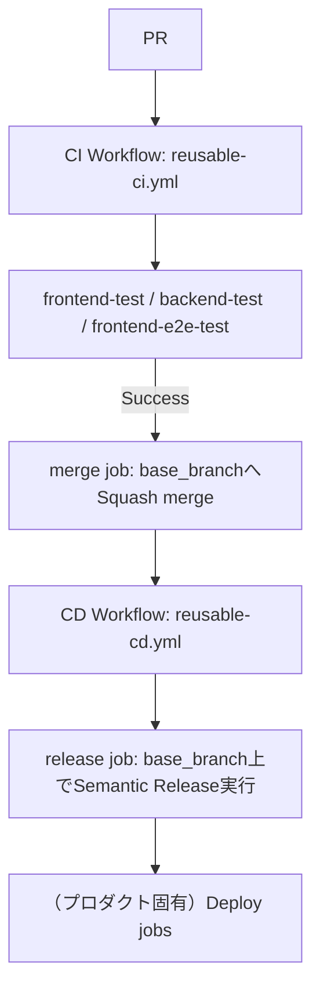

# CI/CD Pipeline Specification（共通）

本ドキュメントは `.github/workflows/reusable-ci.yml` / `reusable-cd.yml` が提供する共通 CI/CD パイプラインの仕様を示す。

frontend/backend のビルド・デプロイ手順（デプロイ先、固有の環境変数など）はプロダクトごとに異なるため対象外であり、参照側リポジトリの `docs/cicd-pipeline-specification.md` に記載する。

## Architecture



## 1. CI ワークフロー (`reusable-ci.yml`)
- **トリガー**: 参照側 `ci.yml` の `on` 設定に従う（通常 `base_branch` へのプッシュ、全プルリクエスト）
- **実行内容**:
  - `commitlint`: コミットメッセージが Conventional Commits 形式に従っているか検証
  - `frontend-test`: frontend の Lint・Vitest テスト・ビルド
  - `backend-test`: backend の Lint・Vitest テスト
  - `frontend-e2e-test`（任意、`enable_e2e_test: true` の場合のみ）: Playwright による E2E テスト
  - `merge`（`enable_auto_merge: true`（デフォルト）の場合のみ）: PR の場合、テスト成功後に `base_branch` へ自動マージ（Squash merge、作業ブランチ削除）する。バージョン計算・タグ付け・GitHub Release作成は行わない（`reusable-cd.yml` 側に移動、後述）
  - このジョブは **`merge-queue-<repository>` という固定名の `concurrency` グループで直列化**されており、複数 PR が同時にマージされても順番に処理される（キャンセルはされない）
  - `enable_auto_merge: false` を指定すると `merge` job がスキップされ、CI チェックのみを行う。マージは人手で行う必要がある

入力パラメータ（`frontend_dir` / `backend_dir` / `node_version` / `workspaces` / `enable_e2e_test` / `enable_auto_merge`）は README.md を参照。`enable_release` / `semantic_release_node_version` / `base_branch` / `enable_changelog_json` / `changelog_source_path` / `changelog_json_output_path` / `enable_shared_release_config` はこのワークフローでは非推奨（後方互換のため入力自体は残しているが未使用）であり、同名の入力を `reusable-cd.yml` 側に指定すること。

## 2. CD ワークフロー (`reusable-cd.yml`)
- **トリガー**: 参照側 `cd.yml` の `on` 設定に従う（通常 `base_branch` へのプッシュ）
- **実行内容**:
  - `release`（`enable_release: true`（デフォルト）の場合のみ）: `base_branch` 上で直接 `semantic-release` を実行し、バージョン自動採番・`CHANGELOG.md` 更新・タグ付け・GitHub Release作成を行う
  - frontend/backend のビルド・デプロイ（GitHub Pages・AWS Lambda 等）はプロダクトごとに異なるため対象外。参照側リポジトリの `cd.yml` に `needs: release` かつ `if: success() && needs.release.outputs.new_release_published == 'true'` の条件でジョブを追加する

入力パラメータ（`enable_release` / `semantic_release_node_version` / `enable_shared_release_config` / `enable_changelog_json` / `changelog_source_path` / `changelog_json_output_path`）は README.md を参照。

semantic-release本体および一部プラグイン（`@semantic-release/npm`、`semantic-release`本体など）は、frontend/backendのビルド・テストに使うNode.jsのバージョン（多くの場合プロダクトのランタイムに合わせて20系などを指定）よりも新しいNode.jsを要求することがある。そのため`release` job内のsemantic-release実行専用に`semantic_release_node_version`（デフォルト`lts/*`）を別途用意している。

## 3. リリース運用
- **リリース条件**: `base_branch` へのpush後に `semantic-release` を実行した結果、リリース対象のコミット（`feat`/`fix` 等）が含まれる場合にのみバージョンが発行される。
- **リリースの手順**:
  1. 通常どおり PR を作成する。
  2. CI（テスト）成功後、`merge` job が `base_branch` へ squash merge する。
  3. その push が CD ワークフローをトリガーし、`release` job が `base_branch` 上で `semantic-release` を実行してバージョンを計算し、`CHANGELOG.md`・`package.json` 等をローカルにコミット・タグ付けする。
  4. `base_branch` が「変更は必ずPR経由」のリポジトリルールで保護されている場合、上記コミットの `base_branch` への直接pushは拒否される（想定内の失敗として扱う）。その場合、`release` job はローカルに作成済みのコミットを新しいブランチへpushし、`base_branch` へのPRを作成してAPI経由でsquash mergeすることで、「PR経由の変更」としてリポジトリルールを満たしたうえで反映する。タグはsquash後のコミットへ付け替え、GitHub Releaseは`CHANGELOG.md`の該当バージョン節から作成する（`@semantic-release/github`のpublishステップは直接pushの失敗により実行されないため）。
  5. リリースPRの作成は参照側リポジトリの通常のCIワークフローも起動する（`pull_request`イベントであるため）。`release` jobはCIの完了を待たずに即座にマージを試みるため、リリースPR自体に対する`merge` jobの自動マージ処理と競合しうるが、後勝ち（`release` job側が先にマージすることが多い）で無害に失敗するのみで実害はない。
- **なぜ `base_branch` へのpush後に実行するのか（旧方式からの変更点）**: 以前は PR の作業ブランチ上でマージ前に `semantic-release` を実行する方式だったが、`pull_request` イベントで GitHub Actions が自動設定する `GITHUB_REF`/`GITHUB_REF_NAME` は `refs/pull/<PR番号>/merge` に固定されておりワークフローYAMLの `env:` では上書きできない（GitHub Actionsの予約変数のため）。そのため semantic-release のブランチ判定が常に `refs/pull/<PR番号>/merge` を見てしまい、「対象ブランチと一致しないため公開しない」と判定されて新バージョンが一切発行されない状態になっていた（各ジョブ自体は成功扱いになるため発覚しにくい）。`base_branch` への実際のpushイベント上で実行すれば `GITHUB_REF` は素直に `refs/heads/<base_branch>` になり、この問題は起きない。ただし `base_branch` がPR必須のリポジトリルールで保護されている場合は上記4のフォールバックが必要になる。

## 共通の環境変数
| 変数名 | 説明 |
|---|---|
| `GITHUB_TOKEN` | GitHub Actions が自動的に提供するトークン。`BOT_TOKEN` 未設定時、`release` job の `@semantic-release/git`（バージョン更新コミットのpush）・`@semantic-release/github`（タグ・GitHub Release作成）のフォールバック先として使う |
| `BOT_TOKEN` | `merge` job での実際の PR マージ（squash merge API 呼び出し）、および `release` job でのバージョン更新コミット・タグのpushに使用するボット用トークン（任意。未設定時は `GITHUB_TOKEN` にフォールバック）。**`base_branch` への push が CD ワークフローのトリガーとなるため、`GITHUB_TOKEN` による push ではCDが起動しない点に注意**（`GITHUB_TOKEN` によるイベントは新たな workflow 実行を作らないため）。`enable_release: true` で運用する場合は `BOT_TOKEN` の設定を推奨する |

プロダクト固有の環境変数（デプロイ先の認証情報など）は参照側リポジトリのドキュメントに記載する。

---

# dev-standards submodule の自動更新（Renovate）について

`dev-standards` を git submodule として特定コミットに固定参照しているリポジトリ（例: karuta）では、
`dev-standards` の `main` が更新されても、submodule 参照コミットを更新しない限り変更が反映されない。

これを自動化するため、Renovate（Mend Renovate）の `git-submodules` マネージャーを利用し、
`dev-standards` の `main` 更新を検知して自動で submodule 更新 PR を作成する。

## 1. 参照側リポジトリへの設定ファイル追加

参照側リポジトリのルートに `renovate.json` を追加する。

```json
{
  "$schema": "https://docs.renovatebot.com/renovate-schema.json",
  "extends": ["config:recommended"],
  "git-submodules": {
    "enabled": true
  }
}
```

`git-submodules` マネージャーは Renovate のデフォルトでは無効になっているため、明示的な有効化が必須。

## 2. Mend Renovate GitHub App のインストール

[GitHub Marketplace の Renovate](https://github.com/apps/renovate) から GitHub App をインストールする。

- **インストール先（resource owner）**: 対象リポジトリを所有する **Organization** を選択する（個人アカウントに誤ってインストールすると、Organization 所有のリポジトリには効かない）
- **Repository access**: 対象リポジトリを含む（`All repositories` または個別選択で対象を含める）
- **アクティベーションキー入力画面**: Mend の有料プラン（Enterprise 向け機能）を有効化するためのものであり、**任意入力**。無料利用（submodule 更新 PR の自動作成など）には不要なため、入力せずスキップしてよい

## 3. リポジトリ単位のモード設定（重要）

インストール後、[Mend ダッシュボード](https://developer.mend.io) の対象リポジトリ設定で、動作モードが以下になっていることを確認する。

- ✅ **自動化された PR（Automated PRs）**
- ❌ **サイレントモード（Silent）** ← このモードのままだと、更新を検知してもスキャン結果がログに残るだけで **PR・Issue は一切作成されない**

「設定ファイルが必要です」の項目は、リポジトリに既に `renovate.json` を用意しているためそのままでよい（オンボーディング PR の作成は不要）。

## 4. 動作確認

GitHub 上で以下を確認する。

- 対象リポジトリに `renovate[bot]`（`author:app/renovate`）による PR・Issue（Dependency Dashboard 含む）が作成されているか
- 未作成の場合は、モード設定（上記3）または Organization/Repository access（上記2）を再確認する

## 5. 承認・マージについて

Renovate が作成する submodule 更新 PR も、通常の PR と同様に人間による承認・マージが必要な運用（CI 自動マージ機構がある場合はそれに従う）とし、
Claude Code がこの PR を承認・マージしてはならない。
