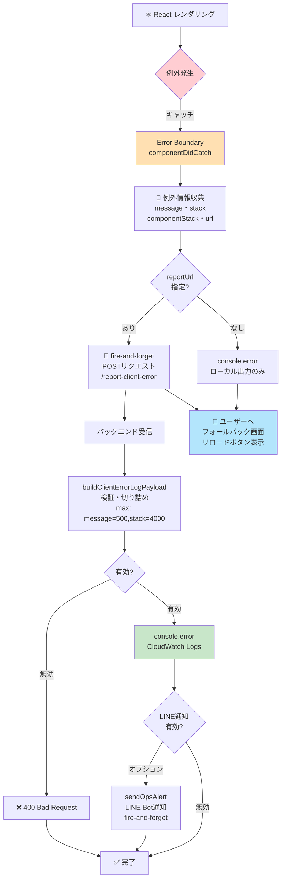

# フロントエンドエラーのError Boundary＋サーバーサイドロギング（`shared/ui/ErrorBoundary.jsx`, `shared/lambda/clientErrorReporting.js`）

レンダリング中の未捕捉例外でReactがツリー全体をアンマウントし、画面が真っ白なまま操作不能になる事象への対策（karuta issue #1106由来）。アプリ全体をError Boundaryで包み、例外発生時にリロードで復帰できるフォールバック画面を出す。加えて、スマホオンリー等の環境でブラウザコンソール確認が困難な場合に備え、バックエンドAPI経由でサーバーサイドログ（CloudWatch Logs等）にも残す（issue #1110由来）。

<details>
<summary>ソースを表示（mermaid記法）</summary>



</details>

フロー：

1. Reactレンダリング中の例外をError Boundaryが捕捉
2. message・stack・componentStack・URLを収集（個人情報は除外）
3. ユーザーへフォールバック画面（リロードボタン）を表示
4. `reportUrl`指定時のみバックエンドAPI（`/report-client-error`）へ非同期送信
5. バックエンド側で検証・切り詰め後、CloudWatch Logsへ記録
6. 任意でLINE運用監視Botへも通知（`docs/ops-monitoring-pattern.md`）

APIレスポンスが遅延してもフォールバック画面表示を妨げないようfire-and-forgetで送信。

## `shared/ui/ErrorBoundary.jsx`

`sync-manifest.local.json`経由でsymlink共有する（考え方は`docs/shared-ui-components.md`と共通）。

```jsx
import ErrorBoundary from "./components/ErrorBoundary.jsx"; // symlink
import { API_BASE_URL } from "./config";

createRoot(document.getElementById("root")).render(
  <ErrorBoundary reportUrl={`${API_BASE_URL}/report-client-error`}>
    <App />
  </ErrorBoundary>
);
```

- `reportUrl`（任意）: 指定すると、捕捉した例外情報（`message`・`stack`・`componentStack`・発生ページの`url`）をこのURLへfire-and-forget（送信失敗は握りつぶす。フォールバック画面の表示を妨げないため）でPOSTする。未指定時は`console.error`とフォールバック画面表示のみ行う
- フォールバック画面のマークアップはBootstrap 5.3のユーティリティクラス前提（`docs/standard-tech-stack.md`の標準構成）
- プレイ内容・入力内容等の個人情報・利用状況の詳細は収集しない（収集するのはJavaScriptの例外情報のみ）

## `shared/lambda/clientErrorReporting.js`

`reportUrl`の送信先エンドポイントの実装で使う、リクエストボディの検証・切り詰めロジック。`dailyRateLimit.js`と同様、npmパッケージに依存しないプレーンな関数として提供し、実際のHTTPレスポンス生成・CORS処理・`console.error`呼び出し自体は呼び出し側の既存実装（`httpResponse.js`等）に委ねる。

```js
const { buildClientErrorLogPayload } = require("./clientErrorReporting.js"); // symlink先

exports.reportClientError = async (event) => {
  const allowedOrigin = resolveAllowedOrigin(event);
  try {
    const body = JSON.parse(event.body);
    const payload = buildClientErrorLogPayload(body);
    if (!payload) {
      return badRequest(allowedOrigin, "Invalid input");
    }

    // Lambdaの標準動作でCloudWatch Logsに残る
    console.error("[ClientError]", payload);

    return jsonResponse(allowedOrigin, 200, { message: "Error reported successfully" });
  } catch (error) {
    return serverError(allowedOrigin, error);
  }
};
```

`serverless.yml`側は、他のPOSTエンドポイントと同様に定義する。

```yaml
reportClientError:
  handler: handler.reportClientError
  events:
    - http:
        path: report-client-error
        method: post
        cors:
          origins: ${self:custom.allowedOrigins}
```

`buildClientErrorLogPayload(body)`は、`message`が無い（≒不正な入力）場合は`null`を返す。呼び出し側はこの場合400を返すこと。認証の無い公開エンドポイントを想定しているため、内容の真偽は検証できない前提で、各フィールドに長さ上限（`message`: 500文字、`stack`/`componentStack`: 4000文字、`url`: 500文字）を設け、悪意ある大量送信でログの容量・コストが膨らむのを防いでいる。

## LINEへの通知（任意、`docs/ops-monitoring-pattern.md`との連携）

スマホオンリー環境ではCloudWatch Logsを都度確認しに行くのが難しい。そのため、CloudWatch Logsへの記録に加えて、`shared/lambda/opsAlertNotifier.js`が使う運用監視専用LINE Bot（全プロダクト共通の1チャンネル）へも同じ例外情報を通知したい場合を考える。`buildClientErrorAlertMessage`と`sendOpsAlert`を組み合わせて使う（dev-standards issue #387）。

```js
const { buildClientErrorLogPayload, buildClientErrorAlertMessage } = require("./clientErrorReporting.js"); // symlink先
const { sendOpsAlert } = require("./opsAlertNotifier.js"); // symlink先

exports.reportClientError = async (event) => {
  const allowedOrigin = resolveAllowedOrigin(event);
  try {
    const body = JSON.parse(event.body);
    const payload = buildClientErrorLogPayload(body);
    if (!payload) {
      return badRequest(allowedOrigin, "Invalid input");
    }

    console.error("[ClientError]", payload);

    // fire-and-forget: LINE通知の失敗がAPIレスポンスを妨げてはならない
    sendOpsAlert({
      message: buildClientErrorAlertMessage({ appName: "karuta", message: payload.message, url: payload.url }),
      channelAccessToken: process.env.OPS_ALERT_LINE_CHANNEL_ACCESS_TOKEN,
      userId: process.env.OPS_ALERT_LINE_USER_ID,
    }).catch(() => {});

    return jsonResponse(allowedOrigin, 200, { message: "Error reported successfully" });
  } catch (error) {
    return serverError(allowedOrigin, error);
  }
};
```

`appName`はプロダクトごとの固定文字列を渡す（`buildOpsAlertMessage`と同じく、1つのLINE Botに複数プロダクトからの通知が届くため、どのアプリのエラーかを区別するために必須）。通知先の`OPS_ALERT_LINE_CHANNEL_ACCESS_TOKEN`・`OPS_ALERT_LINE_USER_ID`は`docs/ops-monitoring-pattern.md`「運用監視専用LINE Botについて」と同じ値（同じLINE Bot・同じセッション）を使う。プロダクトごとに新しいLINE Botを用意する必要はない。

フロントエンドの同一バグが多数のユーザーで同時多発すると、この方式では通知件数もそれに比例して増える（`dailyRateLimit.js`等でアプリ単位の1日あたり件数を絞ることもできる）。そこまでの頻度対策が必要かは呼び出し側の判断に委ねる。本パターン自体は組み込むかどうかを含め呼び出し側の任意選択とする。

## `sync-manifest.local.json`への追加例

```json
{
  "symlinks": [
    { "source": "shared/ui/ErrorBoundary.jsx", "target": "frontend/src/components/ErrorBoundary.jsx" },
    { "source": "shared/lambda/clientErrorReporting.js", "target": "backend/clientErrorReporting.js" }
  ]
}
```

## 実例

karuta（`bamiyanapp/karuta`）の`frontend/src/main.jsx`・`backend/handler.js`（`reportClientError`関数）・`backend/serverless.yml`が本パターンの実装例。
