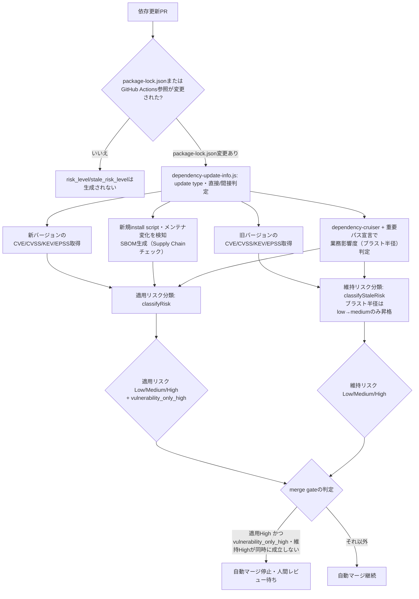

# 依存更新Risk判定

`reusable-ci.yml`の`dependency-risk-summary` job（`enable_dependency_risk_summary`・`enable_dependency_risk_gating`入力）が、依存更新PRに対して行うリスク判定の詳細を扱う。背景はissue #645「OSS依存更新の自動安全判定・エスカレーション基盤」（[bamiyanapp/dev-standards#645](https://github.com/bamiyanapp/dev-standards/issues/645)）を参照。両入力自体の一覧（デフォルト値等）は[`reusable-workflows-reference.md`](reusable-workflows-reference.md)を参照する。

以下は、判定フロー全体を分岐を含む処理フローとして可視化したもの（[bamiyanapp/dev-standards#695](https://github.com/bamiyanapp/dev-standards/issues/695)）。本ドキュメントの各節がどこに対応するかの目次としても使える。個別の昇格ルールの詳細は本ドキュメントの各節、および`scripts/dependency-risk-classifier.js`のコードコメントを正本とし、ここでは全体構造のみを示す。

<details>
<summary>ソースを表示（mermaid記法）</summary>



上記の```mermaid```ブロックはPR差分ビュー・API経由でのファイル取得等ではテキストのまま表示される。図としては確認できない（[bamiyanapp/karuta#824](https://github.com/bamiyanapp/karuta/issues/824)）。ソース（mermaid記法）はこのまま維持する。下記は`enable_mermaid_render`（`render-mermaid-diagrams` job）が再レンダリングした画像である（常に最新版）。`base_branch`へのマージのたびに、`docs-diagrams`ブランチの`latest/`へ上書き公開する。

</details>


## Risk Summaryの投稿（`enable_dependency_risk_summary`）

`package-lock.json`・`.github/workflows/*.yml`・`.github/actions/*/action.yml`のいずれかが変更されたPRで、以下をまとめたRisk Summaryを投稿する。Phase 1は[#646](https://github.com/bamiyanapp/dev-standards/issues/646)、Phase 3は[#648](https://github.com/bamiyanapp/dev-standards/issues/648)を参照。Renovate等が作成した依存更新PRのリスク判断を、人間が調査を始める前に補助する情報を用意するのが目的。各ステップは`continue-on-error: true`のため、このjobの失敗が`merge` jobをブロックすることはない。

- update type（major/minor/patch）・直接/間接依存・CVE/CVSS/EPSS/KEV・CI結果・ファンアウト（dev-standards自体の更新の場合）
- GitHub Actions/reusable workflow参照の更新（dev-standards自体を含むworkflow参照のバージョン更新）
- **Supply Chainチェック**（[#648](https://github.com/bamiyanapp/dev-standards/issues/648) Phase 3）: 新規にinstall scriptを持つようになったパッケージの検知（マルウェア混入の兆候）・メンテナ（公開者）が変化したパッケージの検知（乗っ取りの兆候）・SBOM生成（本体はartifactとして保存し、要約のみコメントに掲載）
- **業務影響度（ブラスト半径）**: 変更された直接依存のimport元が、重要パスに該当する場合を考える。重要パスはリポジトリルートの`dependency-risk-critical-paths.json`（`{"criticalPaths": ["frontend/src/payment/"]}`形式、パスのprefix文字列でglobは使わない）で宣言する。該当する場合、適用リスクを1段階昇格する。宣言が無い場合は昇格しない（[#689](https://github.com/bamiyanapp/dev-standards/issues/689)）

## 適用リスク

このPRを適用する場合のLow/Medium/High判定。Highへ到達した理由がCVE/KEV残存のみかどうかを示す`vulnerability_only_high`も合わせて出力する（[#700](https://github.com/bamiyanapp/dev-standards/issues/700)）。

## 維持リスク

このPRを適用せず現行バージョンに留まる場合のLow/Medium/High判定（更新前バージョンのCVE/KEVを見る、[#690](https://github.com/bamiyanapp/dev-standards/issues/690)）。業務影響度に該当する場合はlowからmediumへ1段階昇格する。維持リスクのhighへの昇格は既知のCVE/KEVのみを根拠とする設計のため、ブラスト半径単独ではhighへ昇格しない（[#701](https://github.com/bamiyanapp/dev-standards/issues/701)）。

## merge gateとの連携（`enable_dependency_risk_gating`）

適用リスク（risk_level、Low/Medium/High）がhighのPRでは`merge` jobによる自動マージを行わない（[bamiyanapp/dev-standards#647](https://github.com/bamiyanapp/dev-standards/issues/647)「Phase 2」Task 3）。対象をHighのみへ縮小した経緯は[#685](https://github.com/bamiyanapp/dev-standards/issues/685)を参照。

- ただし`vulnerability_only_high`（適用リスクがhighに達した理由がCVE/KEV残存のみであること）かつ維持リスクがhighの場合は、放置の方が危険なため適用リスクがhighでも自動マージを止めない（[#690](https://github.com/bamiyanapp/dev-standards/issues/690)）
- major update・CI失敗・supply chain異常（install script異常・メンテナ変化）・ブラスト半径由来のHigh（`vulnerability_only_high`がfalse）は、この救済の対象外であり維持リスクに関わらず自動マージを止める。新旧どちらを選ぶかという比較が成り立たず、PR自体の危険性・複雑さが理由のため（[#700](https://github.com/bamiyanapp/dev-standards/issues/700)）
- 適用リスクがLow/Medium判定、またはrisk_levelが無い（`package-lock.json`を変更していないPR等で`dependency-risk-summary` job自体が実行されなかった場合）は、他のCI条件のみで自動マージの可否を判定する従来どおりの動作になる。`enable_dependency_risk_summary`が`false`の場合はrisk_level・stale_risk_level自体が生成されないため、本入力の値に関わらず常に従来どおりの動作になる
