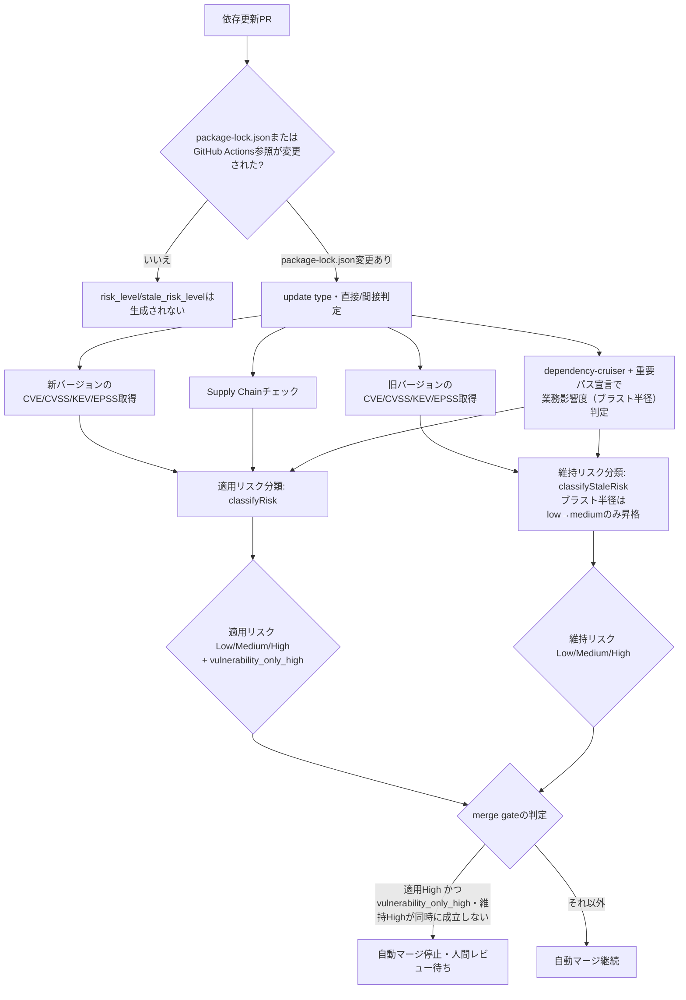

# 依存更新Risk判定

`reusable-ci.yml`の`dependency-risk-summary` job（`enable_dependency_risk_summary`・`enable_dependency_risk_gating`入力）が、依存更新PRに対して行うリスク判定の詳細を扱う。背景はissue #645「OSS依存更新の自動安全判定・エスカレーション基盤」（[bamiyanapp/dev-standards#645](https://github.com/bamiyanapp/dev-standards/issues/645)）を参照。両入力自体の一覧（デフォルト値等）は[`reusable-workflows-reference.md`](reusable-workflows-reference.md)を参照する。

以下は、判定フロー全体を分岐を含む処理フローとして可視化したもの（[bamiyanapp/dev-standards#695](https://github.com/bamiyanapp/dev-standards/issues/695)）。本ドキュメントの各節がどこに対応するかの目次としても使える。個別の昇格ルールの詳細は本ドキュメントの各節、および`scripts/dependency-risk-classifier.js`のコードコメントを正本とし、ここでは全体構造のみを示す。

<details>
<summary>ソースを表示（mermaid記法）</summary>



上記の```mermaid```ブロックはPR差分ビュー・API経由でのファイル取得等ではテキストのまま表示される。図としては確認できない（[bamiyanapp/karuta#824](https://github.com/bamiyanapp/karuta/issues/824)）。ソース（mermaid記法）はこのまま維持する。下記は`enable_mermaid_render`（`render-mermaid-diagrams` job）が再レンダリングした画像である（常に最新版）。`base_branch`へのマージのたびに、`docs-diagrams`ブランチの`latest/`へ上書き公開する。

</details>


## Risk Summaryの投稿（`enable_dependency_risk_summary`）

`package-lock.json`・`.github/workflows/*.yml`・`.github/actions/*/action.yml`のいずれかが変更されたPRで、以下をまとめたRisk Summaryを投稿する。Phase 1は[#646](https://github.com/bamiyanapp/dev-standards/issues/646)、Phase 3は[#648](https://github.com/bamiyanapp/dev-standards/issues/648)を参照。Renovate等が作成した依存更新PRのリスク判断を、人間が調査を始める前に補助する情報を用意するのが目的。各ステップは`continue-on-error: true`のため、このjobの失敗が`merge` jobをブロックすることはない。

- **update type・直接/間接判定**（CVE/CVSS/EPSS/KEV・CI結果・ファンアウト（dev-standards自体の更新の場合）の算出元にもなる、詳細は次節）
- GitHub Actions/reusable workflow参照の更新（dev-standards自体を含むworkflow参照のバージョン更新）
- **Supply Chainチェック**（新規install script・メンテナ変更・SBOM、詳細は次々節）
- **業務影響度（ブラスト半径）**: 変更された直接依存のimport元が、重要パスに該当する場合を考える。重要パスはリポジトリルートの`dependency-risk-critical-paths.json`（`{"criticalPaths": ["frontend/src/payment/"]}`形式、パスのprefix文字列でglobは使わない）で宣言する。該当する場合、適用リスクを1段階昇格する。宣言が無い場合は昇格しない（[#689](https://github.com/bamiyanapp/dev-standards/issues/689)）

## update type・直接/間接判定（`dependency-update-info.js`）

更新前後2つの`package-lock.json`を比較し、変更されたパッケージごとに以下を判定する。後続の適用リスク分類（`classifyRisk()`）・維持リスク分類（`classifyStaleRisk()`）・業務影響度（ブラスト半径）判定は、いずれもこの判定結果を入力として使う。

- **update type**: 新旧バージョンのsemver（major.minor.patch）を比較し、`major`/`minor`/`patch`のいずれかに分類する。プレリリース等でバージョン比較ができない場合・バージョンが不変の場合・ダウングレードの場合は`other`として扱う。`other`はRisk判定側で保守的にHigh相当として扱う
- **直接/間接判定**: `package-lock.json`のルートエントリ（`packages[""]`）が宣言する依存であれば直接依存とする。npm workspaces構成（`packages[""].workspaces`）の場合は、各ワークスペースメンバー自身の`package.json`が宣言する依存も合算する（karutaの実環境で、この合算が漏れており全依存が常に「間接」と誤分類されていたことが発覚し修正した。[#720](https://github.com/bamiyanapp/dev-standards/issues/720)参照）。業務影響度（ブラスト半径）判定は、直接依存のみを対象にする

## Supply Chainチェック（[#648](https://github.com/bamiyanapp/dev-standards/issues/648) Phase 3）

CVE/CVSS/KEVチェック（上記）は「既知の脆弱性があるかどうか」を見る。Supply Chainチェックはこれとは別の観点で、OSSパッケージそのものに不自然な変化が無いかを見る。CVEが0件でも、install script追加や公開者変更等の別のリスクシグナルが存在し得るため、両方を独立に見る。

**重要**: いずれの検知結果も、悪性であることを証明するものではない。通常のバージョン更新では見落としやすい変化を検出し、人間による確認が必要かどうかを判断するための**シグナル**である。「検知＝Riskを上げる材料」ではあるが、「検知＝即危険」ではない。

| チェック | 検知対象 | Riskへの使い方 |
|---|---|---|
| 新規install script | インストール時に実行されるコードの有無の変化（`package-lock.json`の`hasInstallScript`フラグ比較のみ、外部通信無し） | 異常変化としてHighへ格上げする材料 |
| メンテナ（公開者）変更 | npm registryの公開者情報（`_npmUser.name`）の変化 | takeover等のシグナルとしてHighへ格上げする材料 |
| SBOM生成 | 実際に含まれるコンポーネントと依存関係そのもの | Risk判定には使わない。影響範囲の追跡・監査のための証跡 |

### 新規install scriptの検知（例）

```
更新前: @scope/pkg@1.0.0 → hasInstallScript: false
更新後: @scope/pkg@1.1.0 → hasInstallScript: true
```

`package-lock.json`（lockfileVersion 3）は、実際のscript本文ではなく`hasInstallScript`という真偽値フラグのみを記録する（本文自体はpackage.json側にあり、lockfileには含まれない）。このフラグが新規に`true`へ変化したパッケージを検知する（`scripts/dependency-package-anomaly-info.js`）。既存パッケージがinstall scriptを失う（`true`→`false`）変化は、より安全な状態への変化のため検知対象としない。

### メンテナ（公開者）変更の検知（例）

```
更新前: publisher = alice
更新後: publisher = mallory
```

旧バージョンと新バージョンでnpm registry上の公開者（npmアカウント名）が異なる場合に検知する（`scripts/dependency-maintainer-info.js`）。暗号学的な署名検証（provenance attestation等）は対象外である（詳細は同ファイルのコードコメント参照）。

### SBOM（Software Bill of Materials）

SBOMはRisk判定そのものには使わない。**「何が入っているか」を記録するための証跡**である（本体はartifactとして保存し、要約のみRisk Summaryコメントに掲載する）。artifact（zip）をスマートフォンで開いて確認するのは現実的ではないため、ライセンス不明のコンポーネントだけは名前・バージョンをコメント内へ直接列挙する（[#716](https://github.com/bamiyanapp/dev-standards/issues/716)）。

依存関係を記録しておくことで、将来新たなCVEが公表された際に影響範囲を逆引きできる。

```
Application → library A → library B → library C
```

上記の依存関係が分かっていれば、`library C`に新規CVEが公表された場合、`library B`・`library A`経由で`Application`まで影響が及ぶことを即座に追跡できる。

### Risk Engineとの接続

install script・メンテナ変更の検知結果は、適用リスク分類（`classifyRisk()`、`scripts/dependency-risk-classifier.js`）へそのまま入力され、検知された場合は無条件でHighへ格上げする。一方、SBOMの生成結果（`sbom.json`・要約）は適用リスク分類には渡されない。Risk Summaryコメント上の別セクションとして表示されるのみである。

```
install script検知: NEW      ─┐
メンテナ変更検知:   CHANGED  ─┼─→ classifyRisk() → 適用リスク（Low/Medium/High）
SBOM生成:           実施済み ─┘   （SBOMはRisk判定へは渡らない。証跡として別表示のみ）
```

## 適用リスク

このPRを適用する場合のLow/Medium/High判定。Highへ到達した理由がCVE/KEV残存のみかどうかを示す`vulnerability_only_high`も合わせて出力する（[#700](https://github.com/bamiyanapp/dev-standards/issues/700)）。

## 維持リスク

このPRを適用せず現行バージョンに留まる場合のLow/Medium/High判定（更新前バージョンのCVE/KEVを見る、[#690](https://github.com/bamiyanapp/dev-standards/issues/690)）。業務影響度に該当する場合はlowからmediumへ1段階昇格する。維持リスクのhighへの昇格は既知のCVE/KEVのみを根拠とする設計のため、ブラスト半径単独ではhighへ昇格しない（[#701](https://github.com/bamiyanapp/dev-standards/issues/701)）。

## merge gateとの連携（`enable_dependency_risk_gating`）

適用リスク（risk_level、Low/Medium/High）がhighのPRでは`merge` jobによる自動マージを行わない（[bamiyanapp/dev-standards#647](https://github.com/bamiyanapp/dev-standards/issues/647)「Phase 2」Task 3）。対象をHighのみへ縮小した経緯は[#685](https://github.com/bamiyanapp/dev-standards/issues/685)を参照。

- ただし`vulnerability_only_high`（適用リスクがhighに達した理由がCVE/KEV残存のみであること）かつ維持リスクがhighの場合は、放置の方が危険なため適用リスクがhighでも自動マージを止めない（[#690](https://github.com/bamiyanapp/dev-standards/issues/690)）
- major update・CI失敗・supply chain異常（install script異常・メンテナ変化）・ブラスト半径由来のHigh（`vulnerability_only_high`がfalse）は、この救済の対象外であり維持リスクに関わらず自動マージを止める。新旧どちらを選ぶかという比較が成り立たず、PR自体の危険性・複雑さが理由のため（[#700](https://github.com/bamiyanapp/dev-standards/issues/700)）
- 適用リスクがLow/Medium判定、またはrisk_levelが無い（`package-lock.json`を変更していないPR等で`dependency-risk-summary` job自体が実行されなかった場合）は、他のCI条件のみで自動マージの可否を判定する従来どおりの動作になる。`enable_dependency_risk_summary`が`false`の場合はrisk_level・stale_risk_level自体が生成されないため、本入力の値に関わらず常に従来どおりの動作になる

## 適用リスクHigh・維持リスクLowのPRの自動クローズ（`enable_dependency_risk_auto_close`）

適用リスクHigh・維持リスクLow（このPRを適用するのは危険だが、適用せず現行バージョンに留まるのは安全）の組み合わせを考える。この場合、人間が確認するまでもなく「適用しない」が明確な結論である（[#746](https://github.com/bamiyanapp/dev-standards/issues/746)）。`enable_dependency_risk_auto_close`が`true`の場合、この組み合わせを検知したPRへ理由をコメントした上で自動的にクローズする（マージはしない）。

- 誤って人間作成のPRを自動クローズしてしまう事故を避けるため、PR作成者がbotアカウント（GitHub APIの`user.type === 'Bot'`、Renovate等）の場合のみ対象とする
- 判定が誤っていると思われる場合は、クローズされたPRを再オープンすれば従来どおり扱われる（再クローズする仕組みは無い）
- 本機能は`enable_dependency_risk_gating`（merge gateとの連携）とは独立している。gatingを無効化していても、auto_closeが有効であればこの組み合わせのPRはクローズされる

## dev-standards自身のリリースにおけるRisk判定履歴（issue #746 Phase 2）

dev-standards自体の依存更新を考える。Renovate等によるPRがmainへマージされ、semantic-releaseが新バージョンをリリースする際のRisk判定結果を記録したい。各プロダクトリポジトリ（karuta等）が参照できるよう`docs/generated/dependency-risk-history.json`へ機械可読な形で残す。

- `reusable-cd.yml`の`release` jobへ、dev-standards自身（`github.repository == 'bamiyanapp/dev-standards'`）の場合のみ実行されるステップを追加した
- このステップは前回リリースタグとの`package-lock.json`差分から、このPR作成時の`dependency-risk-summary` jobと同じ判定材料（update type・install script異常・メンテナ変化・CVE/CVSS/EPSS/KEV）を再計算する
- 外部API呼び出し（OSV.dev・CISA KEV・npm registry）を含むため、一時的な障害でリリース自体を失敗させないようこのステップ全体を`continue-on-error`にする
- 計算結果は`scripts/append-dependency-risk-history.js`が`docs/generated/dependency-risk-history.json`へ追記し、リリースコミットへ含める
- このスクリプトはsemantic-releaseの`changelogPrepareCmd`から`${nextRelease.version}`付きで呼ばれる
- このスクリプトはどのような内部エラーが起きても必ず正常終了する。`changelogPrepareCmd`の失敗は`@semantic-release/git`によるコミット自体を止めてしまうため、安全側に倒す
- ファイルの形式: `{ version, date, riskLevel, riskReasons, staleRiskLevel, staleRiskReasons }`の配列。同一`version`への再追記は上書きする（リトライ時の重複防止）
- 初回リリース等、比較対象となる前回タグが存在しない場合は追記自体をスキップする

### プロダクト側（karuta等）での利用（issue #746 Phase 2b）

`chore(deps): update bamiyanapp/dev-standards action to vX.Y.Z`等、dev-standards自身への参照を更新するPRを考える。このPRでは`dependency-risk-summary` jobが`scripts/dependency-risk-history-lookup.js`を実行する。

- このスクリプトは新ref（タグ）時点の`docs/generated/dependency-risk-history.json`を`raw.githubusercontent.com`経由で取得する
- 旧refより新しくかつ新ref以下のバージョン（複数バージョンを一度に飛び越える更新PRも含む）に該当する履歴エントリを絞り込む
- 絞り込んだ結果をRisk Summaryコメントへ「dev-standards側で既に評価済みのRisk」セクションとして追記する。dev-standards自身が自らのリリース時点で下した判定結果を、プロダクト側でゼロから再評価する重複作業を避けるのが目的
- ネットワーク呼び出しを伴うため、このステップは`continue-on-error`にしている。履歴ファイルが存在しない場合（本機能導入前の古いタグ等）や取得に失敗した場合は、セクション自体を省略する安全側の動作とする
- dev-standards自身への参照更新を含まないPRでは、このステップは何も出力しない
