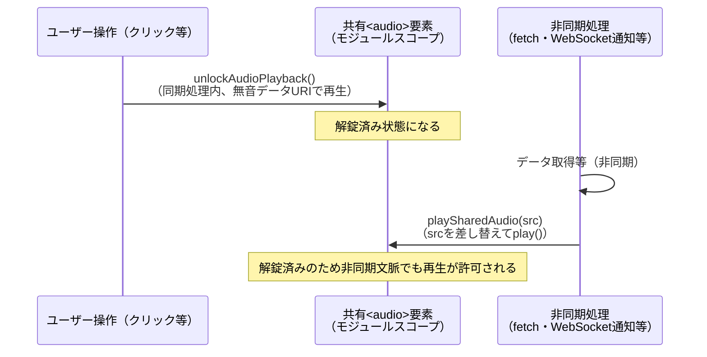

# iOS Safari自動再生ポリシー対策（音声要素シングルトン解錠パターン）

通知音・BGM・読み上げ等、音声を非同期文脈（`fetch`完了後のコールバック、WebSocket通知の受信等）で再生するあらゆるWebアプリに共通する、Safari（iOS/macOS）の自動再生ポリシーへの対策パターン。karuta（[bamiyanapp/karuta](https://github.com/bamiyanapp/karuta)）の`frontend/src/utils/audioUnlock.js`から、かるた固有の効果音の管理部分（`QUIZ_SFX_*`・`playQuizSfx`系）を除いた汎用部分を文章化したもの。CLAUDE.md「開発環境の制約（スマホオンリー）」が名指しする「検証端末はiPhone（iOS Safari）」という制約に直結する知見。

## 問題: 非同期文脈での`play()`がSafariにブロックされる

Safariは`HTMLAudioElement`ごとに「ユーザー操作（クリック/タップ）の中で一度でも再生された要素かどうか」を見て、以降の非同期文脈での`play()`を許可するかどうかを判断する。

「ボタン押下→WebSocketで通知を受信→APIから音声データを取得→取得できたら`play()`」のような非同期処理の中で、その都度`new Audio(...)`していると、その要素自体は一度もユーザー操作中に再生されていないためSafariにブロックされ続けてしまう。

## 解決: 単一`<audio>`要素を解錠しておき、以降はsrcを差し替えて再生する

1. ページ内で使い回す単一の`<audio>`要素（シングルトン）を用意する
2. クリック等のユーザー操作の**同期処理内**（`await`の前）で、この要素自身を無音データURIで一度再生しておく（解錠）
3. 以降は同じ要素の`src`を差し替えて`play()`し直す。非同期文脈からの再生であっても、要素自体は解錠済みのためSafariに許可される

ユーザー操作の発生箇所（例: トップページのボタンクリック）と、実際に音声を再生する箇所（例: 別画面の非同期処理）が別のコンポーネントのライフサイクルにまたがることが多いため、コンポーネントの`ref`ではなく**モジュールスコープのシングルトン**として保持する。




## 実装

```js
const SILENT_AUDIO_DATA_URI = "data:audio/wav;base64,UklGRigAAABXQVZFZm10IBAAAAABAAEAQB8AAEAfAAABAAgAZGF0YQAAAAA=";

let sharedAudio = null;

function getSharedAudio() {
  if (!sharedAudio) {
    sharedAudio = new Audio();
  }
  return sharedAudio;
}

// ユーザー操作（クリック/タップ）のハンドラ内から同期的に呼び出すことで、共有<audio>要素を
// 解錠する。非同期処理を挟むとSafariでは解錠扱いにならないため、呼び出し側でawaitの前に呼ぶこと
export function unlockAudioPlayback() {
  try {
    const audio = getSharedAudio();
    audio.src = SILENT_AUDIO_DATA_URI;
    audio.play().catch(() => {});
  } catch {
    // 対応していないブラウザでは何もしない
  }
}

// 解錠済みの共有<audio>要素でsrcを再生する。前の再生と重ならないよう、切り替え前に一旦止める
export function playSharedAudio(src) {
  const audio = getSharedAudio();
  audio.pause();
  audio.src = src;
  return audio.play();
}

// 解錠済みの共有<audio>要素そのものを返す。onended/onerrorの監視やタイムアウト処理等、
// 呼び出し側で再生完了を個別に追跡する必要がある場合はこちらを使う。単に再生を開始する
// だけでよい場合はplaySharedAudioを使う
export function getMainAudio() {
  return getSharedAudio();
}

// 再生中の音声を中断する。sharedAudioが未生成（一度も再生されていない）場合は何もしない
export function stopSharedAudio() {
  if (sharedAudio) {
    sharedAudio.pause();
  }
}

// テスト専用: モジュールスコープのシングルトンをテスト間で共有してしまわないようにリセットする
export function resetSharedAudioForTests() {
  sharedAudio = null;
}
```

以下は呼び出し側の使い方である（トップページ等のクリックハンドラで解錠、別画面の非同期処理で再生）。

```jsx
function TopPageButton() {
  const handleClick = () => {
    unlockAudioPlayback(); // 同期処理内、awaitより前
    navigate("/room/123");
  };
  return <button onClick={handleClick}>入室する</button>;
}

async function onNotificationReceived() {
  const { audioUrl } = await fetchPhrase(); // 非同期処理
  await playSharedAudio(audioUrl); // 解錠済みのため再生が許可される
}
```

## 設計上の要点

- **解錠は必ずユーザー操作ハンドラの同期処理内、`await`より前に行う**。非同期処理を1つでも挟むと、ブラウザはその`play()`呼び出しをユーザー操作起因と見なさなくなる
- 解錠には無音の`data:`URIを使う。実ファイルへの余分なネットワークリクエストを発生させない
- `play()`の`Promise`は再生「開始」時点で解決される。再生完了を待つ必要がある場合（`onended`監視）は`getMainAudio()`で要素自体を取得し、呼び出し側で`onended`/`onerror`を設定する。加えて、`onended`/`onerror`のどちらも発火せずハングする環境に備え、上限時間で強制的に諦めるタイムアウト処理を呼び出し側に持たせるとよい
- 同時に複数の音（例: 効果音と読み上げ音声）を鳴らす必要がある場合は、用途ごとに別の共有`<audio>`要素をモジュールスコープに持つ（それぞれ個別に解錠が必要）。karutaの実装では、読み上げ用（`sharedAudio`）と早押し効果音用（`sharedSfxAudio`、名前ごとのマップ）を分けている
- テスト（vitest + jsdom）では、モジュールスコープのシングルトンがテスト間で共有されてしまわないよう、`resetSharedAudioForTests`のようなテスト専用リセット関数を用意しておく

## 実例

karuta（`bamiyanapp/karuta`）の`frontend/src/utils/audioUnlock.js`が本パターンの完全な実装例（効果音の論理名管理等、かるた固有の拡張を含む）。
