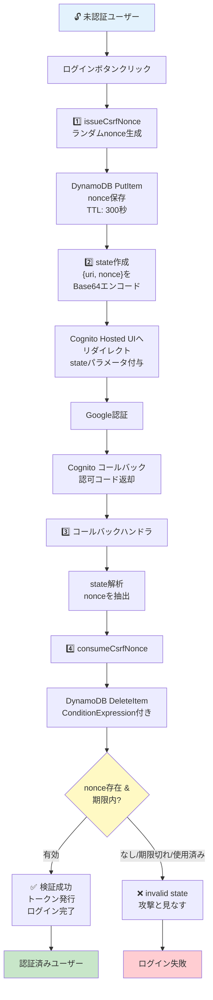

# OAuthログインのCSRF対策はCookieではなくサーバー側nonce管理にする

CloudFront + Lambda@Edge（またはこれに類する構成）でCognito/Google等のOAuthログインを実装する際、ログインCSRF（第三者が発行させた認可コードをこのブラウザに横流しして紐付けさせる攻撃）を防ぐ必要がある。そのための`state`パラメータのnonce検証を、**Cookieではなくサーバー側（DynamoDB）で管理する**。examinationの`infra/site-stack/functions/checkAuth.js`（[examination#143](https://github.com/bamiyanapp/examination/issues/143)）で、Cookie方式の5回にわたる修正の末にたどり着いた設計。

## 問題: なぜCookieでのCSRF対策はOAuthログインフローで壊れやすいか

未認証時のログインリダイレクトでは、nonceを`state`パラメータに埋め込みCognito（IdP）から戻ってきた際に照合する。このnonceを素朴にCookie（例: `csrf_state`）へ保存して照合する実装は、以下の要因でブラウザ側のCookieの生存・一貫性に依存してしまい、「invalid state」エラーが再現性高く発生する。

- **バックグラウンドリクエストによる上書き**: Service Workerのプリキャッシュ、Speculation Rules API（Chrome）による他ページのprefetch等、ユーザー操作を伴わない未認証状態のバックグラウンドリクエストが発生することがある。これらが、ログイン試行中のものとは別のnonceで`csrf_state`Cookieを上書きしてしまう
- **ブラウザのCookieポリシーによる破棄**: 特にSafari等のITP（Intelligent Tracking Prevention）は、クロスサイトリダイレクト直後のCookieを破棄することがある。ログアウト直後の再ログイン（IdP・OAuthプロバイダのセッションが直前まで有効なため認証の往復が高速に完了する）はこのタイミングに該当しやすい

examinationでは「バックグラウンドリクエストをどう見分けてCookie上書きを避けるか」を4回試みた。CloudFrontキャッシュ説→`Sec-Fetch-Mode`ヘッダーでの判別→独自の`X-Precache-Request`ヘッダーでの判別→`Sec-Purpose`ヘッダーでの判別、という順である。いずれも一部のブラウザ・タイミングで再発した。**これらはいずれもCSRF検証をブラウザのCookieに依存させていること自体に起因する構造的な脆弱さ**であり、個別の見分け方を積み重ねても根本解決にならなかった。

## 解決: nonce自体をサーバー側（DynamoDB）で管理する

Cookieを一切使わず、nonce自体の発行・検証・失効をサーバー側のDynamoDBテーブルで完結させる。

<details>
<summary>ソースを表示（mermaid記法）</summary>



</details>

フロー：

1. ランダムなnonceを生成し、DynamoDB（TTL 5分）へ保存
2. nonceをBase64エンコード済み`state`パラメータに埋め込んでIdPへリダイレクト
3. IdP認証後のコールバックで`state`を解析してnonceを抽出
4. `ConditionExpression`付き`DeleteItem`で検証と同時削除（存在・有効期限・未使用を確認）
5. 有効なら認証完了、無効/期限切れ/使用済みなら「invalid state」として拒否

Cookieに依存しないため、Service Worker・ITP・バックグラウンドリクエストの影響を受けない。

```js
const CSRF_NONCES_TABLE = "my-app-csrf-nonces";
const CSRF_NONCE_TTL_SECONDS = 300;

async function issueCsrfNonce() {
  const nonce = crypto.randomBytes(16).toString("hex");
  await ddb.send(
    new PutItemCommand({
      TableName: CSRF_NONCES_TABLE,
      Item: {
        nonce: { S: nonce },
        expiresAt: { N: String(Math.floor(Date.now() / 1000) + CSRF_NONCE_TTL_SECONDS) },
      },
    })
  );
  return nonce;
}

// DeleteItem + ConditionExpressionによる検証と同時削除。同じnonceでの
// リプレイ（多重コールバック等）・期限切れ後の利用はどちらもfalseになる
async function consumeCsrfNonce(nonce) {
  if (!nonce) return false;
  try {
    await ddb.send(
      new DeleteItemCommand({
        TableName: CSRF_NONCES_TABLE,
        Key: { nonce: { S: nonce } },
        ConditionExpression: "attribute_exists(#n) AND expiresAt > :now",
        ExpressionAttributeNames: { "#n": "nonce" },
        ExpressionAttributeValues: { ":now": { N: String(Math.floor(Date.now() / 1000)) } },
      })
    );
    return true;
  } catch (error) {
    if (error.name === "ConditionalCheckFailedException") return false;
    throw error;
  }
}

// 未認証時のリダイレクト側
const nonce = await issueCsrfNonce();
const state = Buffer.from(JSON.stringify({ uri: request.uri, nonce }), "utf-8").toString("base64");
// state をIdPへのauthorize URLのstateパラメータへ付与してリダイレクト

// コールバック側
const decoded = JSON.parse(Buffer.from(state, "base64").toString("utf-8"));
if (!(await consumeCsrfNonce(decoded.nonce))) {
  // 400 invalid state
}
```

実例: examination `infra/site-stack/functions/checkAuth.js`の`issueCsrfNonce`/`consumeCsrfNonce`（テーブル名は`examination-csrf-nonces`）。

## 前提となるDynamoDBテーブル定義

パーティションキー`nonce`（文字列）のみを持ち、TTL（属性名`expiresAt`固定）を有効にしたテーブルを用意する。呼び出し側のLambda実行ロールに、このテーブルへの`dynamodb:PutItem`・`dynamodb:DeleteItem`権限を付与する。

```yaml
MyAppCsrfNoncesTable:
  Type: AWS::DynamoDB::Table
  Properties:
    TableName: my-app-csrf-nonces
    AttributeDefinitions:
      - AttributeName: nonce
        AttributeType: S
    KeySchema:
      - AttributeName: nonce
        KeyType: HASH
    BillingMode: PAY_PER_REQUEST
    TimeToLiveSpecification:
      AttributeName: expiresAt
      Enabled: true
```

## 設計上の要点

- nonceのTTLは短命（examinationでは300秒）でよい。ログインリダイレクトからコールバックまでは通常数秒〜数十秒で完結するため
- `DeleteItem`に`ConditionExpression`を付けることが要。単純な`GetItem`→検証→`DeleteItem`の2ステップにすると、その間に同じnonceで2回目のコールバックが飛んできた場合（多重タブでの二重コールバック等）にリプレイを許してしまう。`DeleteItem`自体に条件を持たせ、単一リクエストで検証・失効を同時に行う
- 本パターンはコードの共有ではなく設計判断・教訓の共有が主目的。プロダクトごとにコールバックの実装（Lambda@Edge/API Gatewayなど実行環境が異なる）は個別に実装してよいが、「CSRF nonceをCookieに保存して検証する」設計を選ばないことが最も重要な教訓
