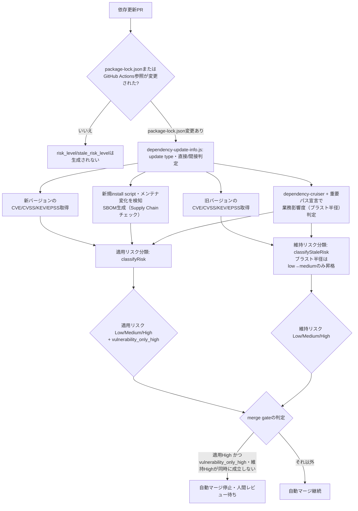

# reusable workflow 導入・入力リファレンス

`docs/cicd-pipeline-specification.md`はCI/CDパイプラインの仕様（各ジョブの実行内容・Architecture）を扱う。これに対し本ドキュメントは、参照側リポジトリでの**導入手順**を扱う。加えて、`reusable-ci.yml` / `reusable-cd.yml` / `reusable-codeql.yml`の**全入力パラメータのリファレンス**も扱う。

## 参照側リポジトリでの導入

参照側リポジトリでは本リポジトリを git submodule として取り込む。

```
git submodule add -b main https://github.com/bamiyanapp/dev-standards.git dev-standards
```

- `CLAUDE.md`: 参照側の `CLAUDE.md` 先頭で `@dev-standards/CLAUDE.md` と記述してインポートする。プロジェクト固有のルール（対象パッケージ名、CI/自動マージ構成など）のみを参照側ファイルに追記する。
- `.clinerules/*.md` ・ `.claude/skills/` 配下の**全Skill** ・ `commitlint.config.cjs` が対象である。加えて `.clineignore` ・ `.claude/settings.json` ・ `.gitignore`も対象。下記の `scripts/bootstrap.js` を参照側リポジトリのルートで実行してセットアップする（手動でのシンボリックリンク作成・コピーは不要）。

  ```
  node dev-standards/scripts/bootstrap.js
  ```

  - `sync-manifest.json`（本リポジトリのルート）に、シンボリックリンク対象・コピー対象のファイル一覧を定義している。新規Skill追加等でこのマニフェストに変更があった場合も、参照側リポジトリで同スクリプトを再実行するだけで追従できる。
  - `--check` を付けると、実際にファイルを変更せずに欠落・リンク切れ・内容の乖離のみを検知する。問題があれば非0終了する（CIでのドリフト検知に利用可能。後述の `enable_standards_check` 入力を参照）。
  - 既存の実ファイル・ディレクトリ（シンボリックリンクではないもの）がリンク先に存在する場合は、誤って上書きしないよう検知のみ行い変更しない。
  - `.claude/settings.json` はプロジェクト固有の許可ルールを追加できない。そのようなルールは参照側リポジトリの `.claude/settings.local.json` に記載する。これはClaude Codeが `settings.json` と合わせてマージする、プロジェクト固有の追加設定ファイルである。
  - `.gitignore` はGitHub側の制約によりシンボリックリンクにできない。symlink化した `.gitignore`/`.gitattributes` はsubmodule経由の攻撃に使われた前例があり、pushしようとすると `gitignoreSymlink` 警告が出る。このため `bootstrap.js` は実体ファイルとしてコピーする。
    - 本リポジトリ側の `.gitignore` は**管理区間**（`# --- dev-standards managed: start ---` 〜 `# --- dev-standards managed: end ---` のマーカーで囲まれた区間）を持つ。`--check`/コピー元との一致判定はこの区間内のみが対象（issue #138）。マーカーが無い場合はファイル全体の完全一致が要求される従来の挙動にフォールバックする
    - 区間外（前後）にはプロジェクト固有のignoreエントリを自由に追記できる。乖離検知の対象外のため、ルート直下の `.gitignore` に直接追記してよい
    - 管理区間内の差分（本リポジトリ側の`.gitignore`更新への追従）は、`bootstrap.js`（`--check` 無し）を再実行すると区間外の追記を保持したまま自動的に再同期される
  - `sync-manifest.json`（本リポジトリのルート）は、全参照側リポジトリで共通に成立するパス（`.clinerules/` 等）のみを収録する前提になっている。プロダクトごとにディレクトリ構成が異なる同期対象がある。例えば `shared/pwa/` 配下のPWAキャッシュ更新パターンである（詳細は `docs/service-worker-update-pattern.md` 参照）。これらは、参照側リポジトリ自身のルートに置く任意の `sync-manifest.local.json` に書く。同じ形式（`symlinks` / `symlinkAllInDir` / `copies`）で記述する。すると`bootstrap.js` が本リポジトリ側の `sync-manifest.json` とマージして同期する。このファイルが存在しないリポジトリの動作には影響しない。
- `docs/cicd-pipeline-specification.md`: Claude Codeの `@import` 構文で解決可能なMarkdownである。そのためシンボリックリンクではなく参照側リポジトリの同名ドキュメントから相対リンクで参照する。参照側には共通ドキュメントに書かれていないプロダクト固有の内容（デプロイジョブ・固有の環境変数など）のみを記載する。

## `reusable-ci.yml`

参照側の `.github/workflows/ci.yml` から呼び出す。`uses: bamiyanapp/dev-standards/.github/workflows/reusable-ci.yml@v1.0.0` ＋ `with:` で値を指定する。`@main`のような未固定のブランチ参照は避け、タグで固定すること。

以下、入力を機能ごとに章立てする。各表のセルは1文程度の要約とし、複数の観点（背景・経緯・デフォルト以外の挙動）を持つ入力は表の直後に箇条書きで補足する。

### テスト・ビルド対象

| 入力 | 説明 | デフォルト |
|---|---|---|
| `frontend_dir` | frontendパッケージのディレクトリ名（`packages`指定時は無視される） | `frontend` |
| `backend_dir` | backendパッケージのディレクトリ名（`packages`指定時は無視される） | `backend` |
| `packages` | frontend/backendの固定2パッケージ構成の代わりに、matrix構成でlint/test/buildするパッケージ一覧をJSON配列で指定する | `""`（既存の固定ジョブを使う） |
| `node_version` | frontend/backendのビルド・テストに使うNode.jsのバージョン | `20` |
| `workspaces` | npm workspaces構成（ルート直下に単一のpackage-lock.jsonのみ）かどうか | `false` |
| `enable_e2e_test` | frontendのE2Eテスト（Playwright）ジョブを実行するかどうか | `false` |

- `packages`: 例 `[{"dir":"frontend","build":true},{"dir":"backend"}]`。各要素は`dir`のみ必須、`build`・`node_version`・`coverage_threshold`は省略可。指定した場合、`frontend-test`/`backend-test`固定ジョブは無効になり、代わりに`package-test`ジョブがmatrix実行される
- `workspaces`: `true`の場合、依存インストールをリポジトリルートで行う
- `enable_e2e_test`: 実行する場合、`frontend_dir`配下に`test:e2e`スクリプトが必要

### カバレッジ閾値

| 入力 | 説明 | デフォルト |
|---|---|---|
| `coverage_threshold` | ユニットテストカバレッジ閾値（%） | `0` |
| `e2e_coverage_threshold` | `frontend-e2e-test`のE2EテストJSカバレッジ閾値（%） | `0` |
| `e2e_coverage_metrics` | `e2e_coverage_threshold`のゲート判定対象指標（カンマ区切り、例: `"statements,functions,lines"`） | `""`（lines/statements/functions/branchesの全4種） |

- いずれも**開発共通標準の目標値は80%以上**。新規導入時は実測値が無いため0から開始してよいが、その値のまま据え置かずテストケースを追加して段階的に80%へ近づける（詳細は`docs/cicd-pipeline-specification.md`参照）
- `coverage_threshold`: 0以下（既定）の場合、`vitest run --coverage`に`--coverage.reporter=json-summary`を追加して`coverage/coverage-summary.json`を生成する。ただし`.github/actions/check-coverage-threshold`による閾値判定・Job Summaryへの表示ステップ自体はスキップする。0より大きい値を指定するとこのステップが実行される。`packages`のmatrix構成では各要素の`coverage_threshold`で上書きできる
- `e2e_coverage_threshold`: `coverage_threshold`と同じ`check-coverage-threshold`複合アクションを使う。対象はPlaywright（monocart-reporter）が出力するE2E実行時のカバレッジで、`coverage_threshold`（ユニットテストカバレッジ）とは独立している（[bamiyanapp/karuta#576](https://github.com/bamiyanapp/karuta/issues/576)、[bamiyanapp/dev-standards#422](https://github.com/bamiyanapp/dev-standards/issues/422)）

### 自動マージ

| 入力 | 説明 | デフォルト |
|---|---|---|
| `enable_auto_merge` | CI成功後に`merge` jobでPRを自動マージするかどうか | `true` |

- `false`の場合`merge` job自体がスキップされ、マージは人手で行う

### 静的チェック

| 入力 | 説明 | デフォルト |
|---|---|---|
| `enable_standards_check` | `scripts/bootstrap.js --check`によるsymlink欠落・リンク切れ・`.gitignore`内容乖離の検知（`standards-check` job） | `false` |
| `enable_duplication_check` | `jscpd`によるコード重複検知（`duplication-check` job） | `false` |
| `duplication_threshold` | コード重複率のしきい値（%） | `0` |
| `enable_doc_duplication_check` | `jscpd`によるMarkdownドキュメント重複検知（`doc-duplication-check` job） | `false` |
| `doc_duplication_threshold` | Markdownドキュメント重複率のしきい値（%） | `0` |
| `doc_duplication_paths` | ドキュメント重複検知の対象パス（ディレクトリまたはファイル） | `""` |
| `enable_architecture_check` | `dependency-cruiser`によるアーキテクチャ違反検知（`architecture-check` job） | `false` |

- `enable_duplication_check`: SonarCloud相当の静的解析をCIネイティブなツールで代替する取り組みの一部（[bamiyanapp/karuta#806](https://github.com/bamiyanapp/karuta/issues/806)）。ESLintの`complexity`ルール・`eslint-plugin-sonarjs`はこのワークフローでは扱わず、参照側リポジトリのESLint設定へ直接追加する（推奨ルールセットは`docs/code-quality-conventions.md`参照）。`submodules: true`でcheckoutするため、参照側リポジトリのproduct codeが`shared/`と重複（symlink化し忘れ）していないかも検知できる（[bamiyanapp/dev-standards#621](https://github.com/bamiyanapp/dev-standards/issues/621)）。`sync-manifest.json`等に列挙済みのsymlink/copyの組は自動生成される除外リストにより誤検知しない
- `duplication_threshold`: 0以下（既定）の場合`jscpd`にゲート判定（`--threshold`）を渡さずJob Summaryへのレポート表示のみ行う。対象はリポジトリ全体のプロダクトコード（テストファイル・`e2e`ディレクトリ配下を除く）。**開発共通標準の目標値は5%以下**（[bamiyanapp/dev-standards#416](https://github.com/bamiyanapp/dev-standards/issues/416)）
- `enable_doc_duplication_check`: `duplication-check`（コード向け）とは別ジョブで、CLAUDE.md・`SKILL.md`間の丸ごとコピペ重複（drift事故の原因）を検知する（[bamiyanapp/dev-standards#586](https://github.com/bamiyanapp/dev-standards/issues/586)）
- `doc_duplication_threshold`: ドキュメント内の埋め込みコードサンプルも`jscpd`の自動判定により別フォーマットとして計上されうるため、意図的に複数の完全なコード例を並べているドキュメントがある場合はその分を許容できる値にすること
- `doc_duplication_paths`: `text_lint_paths`等と異なりglobパターンではなく`jscpd`へそのまま位置引数として渡す。カンマまたは改行区切りで複数指定できる（例: `"docs\nREADME.md\nCLAUDE.md\n.claude/skills"`）
- `enable_architecture_check`: 循環依存と、npm workspacesモノレポでの`frontend_dir`/`backend_dir`間の越境importを検知する（[bamiyanapp/dev-standards#523](https://github.com/bamiyanapp/dev-standards/issues/523)）。共有ルール（`dependency-cruiser.config.cjs`）はdev-standardsからsymlinkで配布するため、参照側リポジトリはこのジョブの有効化のみでよい（詳細は`docs/code-quality-conventions.md`参照）

### ドキュメント品質

| 入力 | 説明 | デフォルト |
|---|---|---|
| `enable_mermaid_render` | mermaidブロックをPNGへ事前レンダリングし`docs-diagrams`ブランチへ公開する（`render-mermaid-diagrams` job） | `false` |
| `mermaid_doc_paths` | レンダリング対象Markdownファイルパス | `""` |
| `enable_text_lint` | textlintによるMarkdown文章品質チェック（`text-lint` job） | `false` |
| `text_lint_paths` | lint対象Markdownのglobパターン | `""` |
| `enable_dead_link_check` | Markdown間の相対リンク切れを検証する（`dead-link-check` job） | `false` |
| `dead_link_check_paths` | 検証対象Markdownのglobパターン | `""` |

- `enable_mermaid_render`: GitHubのPR差分ビュー・API経由でのファイル取得等、mermaidがネイティブレンダリングされない場面向け（[bamiyanapp/karuta#824](https://github.com/bamiyanapp/karuta/issues/824)）。Markdown側のmermaidソース自体は書き換えない。`push`イベントのたびに`docs-diagrams`ブランチの`latest/`へ上書き公開される。そのため、対象Markdownファイルの```` ```mermaid ```` ブロック直後に``を一度だけ手動で埋め込んでおく。すると、ドキュメント本体からも常に最新のレンダリング結果を確認できる（詳細は`docs/cicd-pipeline-specification.md`「1. CIワークフロー」参照）
- `enable_text_lint`: ESLint・stylelintがコード向け、CodeQLがセキュリティ向けの静的解析であるのに対し、こちらはMarkdownドキュメントの文章品質（文体の不統一・表記ゆれ等）を検知する（[bamiyanapp/dev-standards#436](https://github.com/bamiyanapp/dev-standards/issues/436)）。共有設定（`textlint.config.cjs`）はdev-standardsからsymlinkで配布するため、参照側リポジトリはこのjobの有効化と`text_lint_paths`の指定のみでよい
- `enable_dead_link_check`: ドキュメントのリファクタリング・ファイル移動・リネームでリンク切れが発生しても、`text-lint`・`doc-duplication-check`では検知できないため別ジョブとして提供する（[bamiyanapp/dev-standards#603](https://github.com/bamiyanapp/dev-standards/issues/603)）。外部URL（`http`/`https`）は一時的な障害でCIが不安定になることを避けるため検証対象から除外し、相対パスのリンクのみを検証する

### CI実行回数削減

| 入力 | 説明 | デフォルト |
|---|---|---|
| `skip_verification_on_push` | `true`かつ`push`イベントの場合、主要な検証系jobをスキップする | `false` |
| `enable_path_filtering` | `frontend_dir`/`backend_dir`配下の変更有無に応じて該当jobを選択的にスキップする | `false` |

- `skip_verification_on_push`: 対象は`frontend-test`・`backend-test`・`package-test`・`standards-check`・`duplication-check`の5 jobである。加えて`doc-duplication-check`・`architecture-check`・`text-lint`・`dead-link-check`も対象（[bamiyanapp/dev-standards#187](https://github.com/bamiyanapp/dev-standards/issues/187)）。PRが`base_branch`と同期済みでなければマージ不可（up-to-date required）＋Squash merge運用（マージ後のmainのツリーがPR headと完全に一致する）を前提にした最適化である。`pull_request`イベントで既に検証済みの内容を`push`側で再検証しない仕組みのため、この前提が成り立たない運用では有効化しないこと。`frontend-e2e-test`・`render-mermaid-diagrams`は`push`イベントでのみ発生する副作用（`latest/`ベースラインの公開）を担う。そのためスキップ対象に含めない
- `enable_path_filtering`: 対象は`frontend-test`・`backend-test`・`frontend-e2e-test`・`duplication-check`・`architecture-check`（[bamiyanapp/dev-standards#187](https://github.com/bamiyanapp/dev-standards/issues/187)）。ルート直下の`package.json`・`package-lock.json`・`.github/workflows/**`の変更は共通変更とみなしいずれの判定でも「変更あり」を返す。`packages`入力使用時（package-testモード）は対象外（常に全ジョブを実行する）。`standards-check`・`text-lint`・`doc-duplication-check`はいずれもリポジトリ全体のチェックのため対象外（常に実行する）。変更検出自体が失敗した場合は安全側に倒し全ジョブを実行する

### 依存更新Risk判定

| 入力 | 説明 | デフォルト |
|---|---|---|
| `enable_dependency_risk_summary` | 依存更新PRのRisk SummaryをPRコメントへ投稿する（`dependency-risk-summary` job） | `false` |
| `enable_dependency_risk_gating` | 適用リスクがhighのPRで`merge` jobによる自動マージを行わない | `false` |

- `enable_dependency_risk_summary`: `package-lock.json`・`.github/workflows/*.yml`・`.github/actions/*/action.yml`のいずれかが変更されたPRで、以下をまとめたRisk Summaryを投稿する。背景はissue #645「OSS依存更新の自動安全判定・エスカレーション基盤」（[bamiyanapp/dev-standards#645](https://github.com/bamiyanapp/dev-standards/issues/645)）を参照。Phase 1は[#646](https://github.com/bamiyanapp/dev-standards/issues/646)、Phase 3は[#648](https://github.com/bamiyanapp/dev-standards/issues/648)を参照。Renovate等が作成した依存更新PRのリスク判断を、人間が調査を始める前に補助する情報を用意するのが目的。各ステップは`continue-on-error: true`のため、このjobの失敗が`merge` jobをブロックすることはない
  - update type（major/minor/patch）・直接/間接依存・CVE/CVSS/EPSS/KEV・CI結果・ファンアウト（dev-standards自体の更新の場合）
  - GitHub Actions/reusable workflow参照の更新（dev-standards自体を含むworkflow参照のバージョン更新）
  - **Supply Chainチェック**（[#648](https://github.com/bamiyanapp/dev-standards/issues/648) Phase 3）: 新規にinstall scriptを持つようになったパッケージの検知（マルウェア混入の兆候）・メンテナ（公開者）が変化したパッケージの検知（乗っ取りの兆候）・SBOM生成（本体はartifactとして保存し、要約のみコメントに掲載）
  - **業務影響度（ブラスト半径）**: 変更された直接依存のimport元が、重要パスに該当する場合を考える。重要パスはリポジトリルートの`dependency-risk-critical-paths.json`（`{"criticalPaths": ["frontend/src/payment/"]}`形式、パスのprefix文字列でglobは使わない）で宣言する。該当する場合、適用リスクを1段階昇格する。宣言が無い場合は昇格しない（[#689](https://github.com/bamiyanapp/dev-standards/issues/689)）
  - **適用リスク**（このPRを適用する場合のLow/Medium/High判定）。Highへ到達した理由がCVE/KEV残存のみかどうかを示す`vulnerability_only_high`も合わせて出力する（[#700](https://github.com/bamiyanapp/dev-standards/issues/700)）
  - **維持リスク**（このPRを適用せず現行バージョンに留まる場合のLow/Medium/High判定、更新前バージョンのCVE/KEVを見る。[#690](https://github.com/bamiyanapp/dev-standards/issues/690)）。業務影響度に該当する場合はlowからmediumへ1段階昇格する。維持リスクのhighへの昇格は既知のCVE/KEVのみを根拠とする設計のため、ブラスト半径単独ではhighへ昇格しない（[#701](https://github.com/bamiyanapp/dev-standards/issues/701)）
- `enable_dependency_risk_gating`: 適用リスク（risk_level、Low/Medium/High）がhighのPRでは`merge` jobによる自動マージを行わない（[bamiyanapp/dev-standards#647](https://github.com/bamiyanapp/dev-standards/issues/647)「Phase 2」Task 3）。対象をHighのみへ縮小した経緯は[#685](https://github.com/bamiyanapp/dev-standards/issues/685)を参照
  - ただし`vulnerability_only_high`（適用リスクがhighに達した理由がCVE/KEV残存のみであること）かつ維持リスクがhighの場合は、放置の方が危険なため適用リスクがhighでも自動マージを止めない（[#690](https://github.com/bamiyanapp/dev-standards/issues/690)）
  - major update・CI失敗・supply chain異常（install script異常・メンテナ変化）・ブラスト半径由来のHigh（`vulnerability_only_high`がfalse）は、この救済の対象外であり維持リスクに関わらず自動マージを止める。新旧どちらを選ぶかという比較が成り立たず、PR自体の危険性・複雑さが理由のため（[#700](https://github.com/bamiyanapp/dev-standards/issues/700)）
  - 適用リスクがLow/Medium判定、またはrisk_levelが無い（`package-lock.json`を変更していないPR等で`dependency-risk-summary` job自体が実行されなかった場合）は、他のCI条件のみで自動マージの可否を判定する従来どおりの動作になる。`enable_dependency_risk_summary`が`false`の場合はrisk_level・stale_risk_level自体が生成されないため、本入力の値に関わらず常に従来どおりの動作になる

以下は、上記2つの入力が関わる`dependency-risk-summary` job内部の判定フローを、分岐を含む処理フローとしてflowchartへ可視化したもの（[bamiyanapp/dev-standards#695](https://github.com/bamiyanapp/dev-standards/issues/695)）。個別の昇格ルールの詳細は上記の箇条書きおよび`scripts/dependency-risk-classifier.js`のコードコメントを正本とし、ここでは全体構造のみを示す。

<details>
<summary>ソースを表示（mermaid記法）</summary>



上記の```mermaid```ブロックはPR差分ビュー・API経由でのファイル取得等ではテキストのまま表示される。図としては確認できない（[bamiyanapp/karuta#824](https://github.com/bamiyanapp/karuta/issues/824)）。ソース（mermaid記法）はこのまま維持する。下記は`enable_mermaid_render`（`render-mermaid-diagrams` job）が再レンダリングした画像である（常に最新版）。`base_branch`へのマージのたびに、`docs-diagrams`ブランチの`latest/`へ上書き公開する。

</details>


### 補足

`frontend_dir`/`backend_dir`/`node_version`等のCI関連inputとは別に、semantic-releaseの実行に関する入力も存在する。具体的には`enable_release` / `semantic_release_node_version` / `base_branch`が該当する。加えて`enable_changelog_json` / `changelog_source_path`も該当する。`changelog_json_output_path` / `enable_shared_release_config`も同様である。これらは`reusable-cd.yml`側の入力であり、このワークフロー（`reusable-ci.yml`）には存在しない。[bamiyanapp/dev-standards#76](https://github.com/bamiyanapp/dev-standards/issues/76)でのメジャーバージョンアップに伴い削除した。同名の入力を`reusable-cd.yml`側に指定すること（下記）。

`secrets.BOT_TOKEN`（任意）を渡すことができる。これはcommitlintジョブのsubmodule取得や、`merge` jobでの実際のPRマージ（squash merge API呼び出し）で利用される。

## `reusable-cd.yml`

参照側の `.github/workflows/cd.yml` から呼び出す。`uses: bamiyanapp/dev-standards/.github/workflows/reusable-cd.yml@v1.0.0` ＋ `with:` で値を指定する。`@main`のような未固定のブランチ参照は避け、タグで固定すること。

- `base_branch`へのpush時、`release` jobがbase_branch上で直接semantic-releaseを実行する。バージョン自動採番・タグ付けを行い、GitHub Releaseを作成する
- 出力 `new_release_published` / `version` を呼び出し側のデプロイジョブの実行条件に利用できる
- `github.sha`（このpush自体のコミット）はバージョン更新前のコミットを指す。デプロイジョブのcheckout対象には、出力 `release_commit_sha`（base_branch上でバージョン更新が反映された実際のコミットSHA）を使うこと。`github.sha`をそのまま使うと、デプロイされるアプリのバージョン表示・changelogが常に1つ前のリリースのままになる（[bamiyanapp/karuta#1274](https://github.com/bamiyanapp/karuta/issues/1274)）

指定できる入力は以下の通り。

| 入力 | 説明 | デフォルト |
|---|---|---|
| `enable_release` | base_branchへのpush後にsemantic-releaseを実行するかどうか。release運用をしないリポジトリはfalseを指定する | `true` |
| `semantic_release_node_version` | semantic-releaseの実行に使うNode.jsのバージョン。semantic-release本体やプラグインがfrontend/backendより新しいNode.jsを要求することがあるため別に指定する | `lts/*` |
| `enable_shared_release_config` | semantic-releaseの共通設定（`release-config.cjs`の`buildReleaseConfig()`）を`release` job内で参照側リポジトリへコピーするかどうか。有効にする場合、参照側の`.releaserc.cjs`を`require("./release-config.cjs").buildReleaseConfig({...})`を呼び出す構成にする必要がある（`repositoryUrl`・`gitAssets`等のプロダクト固有値のみを渡す） | `false` |
| `enable_changelog_json` | `CHANGELOG.md`をJSON化するスクリプト（`scripts/convert-changelog-to-json.js`）をSemantic Releaseの直前にジョブ内で生成するかどうか。参照側リポジトリがこのファイルをsubmodule経由のシンボリックリンクとして持つ必要がなくなる（このジョブのcheckoutはsubmoduleを取得しないため、symlinkにすると壊れる） | `false` |
| `changelog_source_path` | 変換元の`CHANGELOG.md`パス（リポジトリルート基準）。`enable_changelog_json: true`の場合のみ使用 | `CHANGELOG.md` |
| `changelog_json_output_path` | 変換後のJSON出力先パス（リポジトリルート基準）。`enable_changelog_json: true`の場合のみ使用 | `frontend/src/changelog.json` |

`secrets.BOT_TOKEN`（任意）を渡すと、`release` jobでのバージョン更新コミット・タグのpush、GitHub Release作成に利用される。**`base_branch`へのpushがCDワークフローのトリガーとなる**。**そのため`enable_release: true`で運用する場合は`BOT_TOKEN`の設定を推奨する**（`GITHUB_TOKEN`によるpushはCDをトリガーしない）。

## `reusable-codeql.yml`

参照側の `.github/workflows/codeql.yml` から呼び出す。`uses: bamiyanapp/dev-standards/.github/workflows/reusable-codeql.yml@v1.0.0` ＋ `with:` で値を指定する。`@main`のような未固定のブランチ参照は避け、タグで固定すること。参照側の`codeql.yml`自体の`on:`に`push`・`pull_request`・`schedule`（週次等の定期実行、コード変更が無い期間もクエリセット更新を検知するため推奨）を設定する。指定できる入力は以下の通り。

| 入力 | 説明 | デフォルト |
|---|---|---|
| `languages` | CodeQLで解析する言語をJSON配列形式で指定する（例: `'["javascript-typescript"]'`）。GitHub Actions matrixとしてlanguageごとに展開される | `'["javascript-typescript"]'` |

CodeQLを必須チェックにするかどうかは参照側リポジトリのブランチ保護設定（Required status checks）側の責務である。このワークフロー自体は`reusable-ci.yml`の`merge` jobのマージ処理に関与しない。
