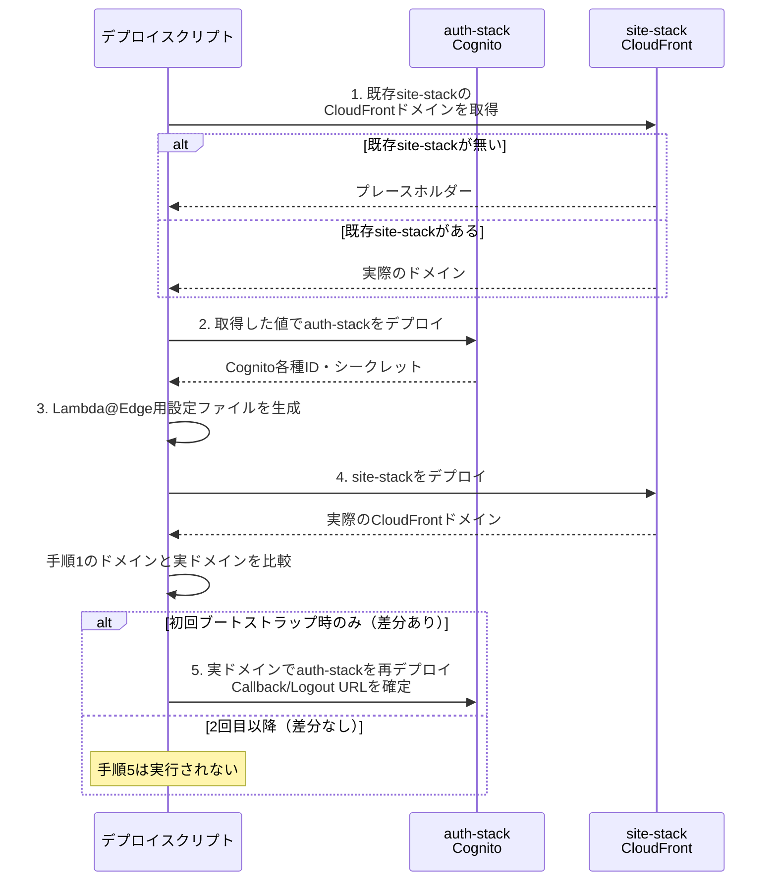
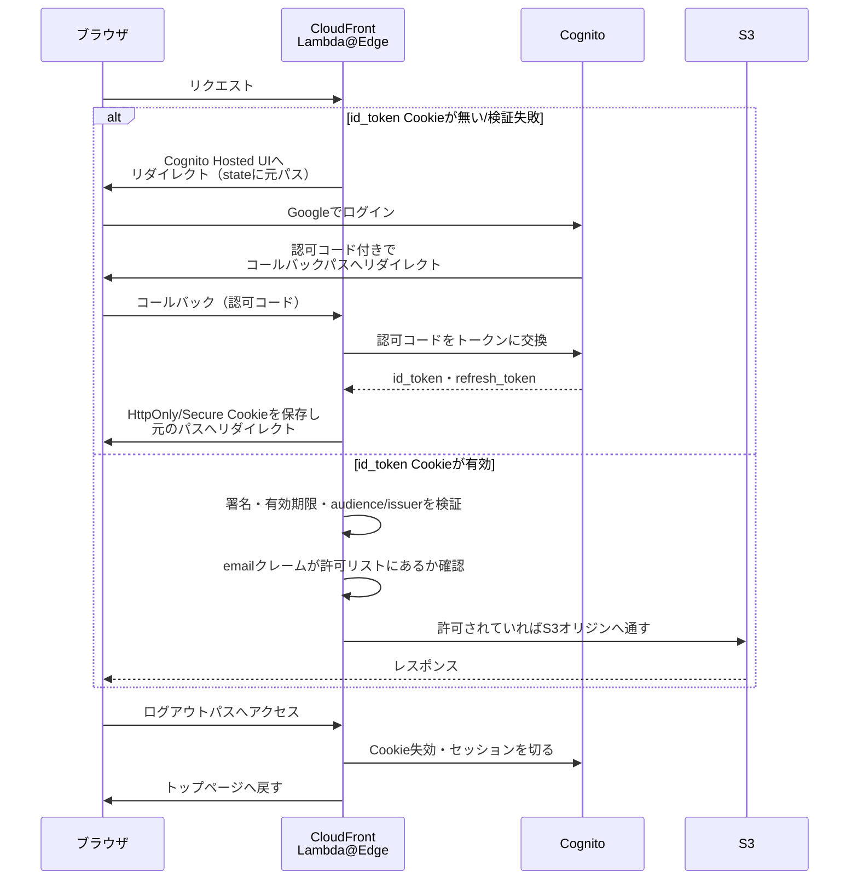

# S3 + CloudFront + Cognito(Google) + Lambda@Edgeによる認証付き静的サイト配信パターン

**標準索引（`docs/standard-tech-stack.md`）からは外れた構成**。dev-standardsの標準では、ログインが必要な場合もフロントエンド自体は誰でも閲覧できるAPI単位認証（「2. ログイン」参照）とする。ホスティングはログイン要否によらずS3 + CloudFront（`docs/static-hosting-pattern.md`）に統一している。本ドキュメントは、サイトの閲覧自体をログイン必須にしたい（トップページ等を含め非公開にしたい）場合の構成として残す。

ログインが必要な小規模な静的サイト（家族・チーム向けナレッジベース等、不特定多数への公開を想定しないもの）を、専用のバックエンドサーバーを持たずに構築するための構成。**OSLS**（`osls`パッケージ、[oss-serverless/osls](https://github.com/oss-serverless/osls)）でAWSリソースをコードとして定義する。OSLSはServerless Framework v4のライセンス変更を受けて採用した、v3系のままオープンソースで開発が継続されているフォークである。詳細は`docs/nextjs-static-lambda-pattern.md`「OSLS vs Serverless Framework本家」を参照。examinationの`infra/`（[examination#6](https://github.com/bamiyanapp/examination/issues/6)）がベースである。そこからプロダクト固有の業務ロジック（LINE bot・面接の練習機能等）を除いた。他プロダクトでも再利用できるインフラ構成部分を切り出したものである。

**examinationは、この構成（手順1のログイン必須化）から既に移行済み**。[examination#437](https://github.com/bamiyanapp/examination/issues/437)がある。これで下記「## 認証フロー」の手順1（サイト閲覧そのもののログイン必須化）を廃止した。フロントエンドは誰でも閲覧できるdev-standards統一標準（`docs/standard-tech-stack.md`「2. ログイン」）へ移行した。`auth-stack`（Cognito）・`site-stack`のLambda@Edge自体は引き続き使われている。ログインフロー（`/_login`・`/_callback`）や家族固有データを返す各APIのリクエスト単位認証（`/_me`等）の基盤としてである。手順2〜4（コールバック・トークン検証・ログアウト）やCSRF対策・セッション自動延長等の個別設計判断も、今なおexaminationが実装例である。ただし、「本パターン」の核である手順1（未認証時は静的コンテンツにも到達させない全リクエストゲート）は、examinationにはもう存在しない。サイト閲覧自体をログイン必須にしたい新規プロダクトは、このドキュメントの設計をそのまま採用する。実装の参照先には注意が必要である。examination#437より前のコミット（`infra/site-stack/functions/checkAuth.js`のリダイレクト分岐がまだ残っていた時点）を確認すること。

コードそのものの共有（symlink化）ではなく、**インフラ構成・設計判断の共有**が目的。実際の完全な実装例はexaminationの`infra/site-stack/`を参照する。

## 全体構成

| スタック | 役割 |
|---|---|
| `auth-stack` | Amazon Cognito（User Pool・Google Identity Provider・User Pool Client・Cognitoドメイン） |
| `site-stack` | S3バケット（静的サイトの格納先）・CloudFrontディストリビューション（Origin Access Control経由でS3へアクセス）・Lambda@Edge（`viewer-request`イベントで全リクエストの認証チェック）・DynamoDBテーブル（閲覧許可メールアドレス一覧） |

認証・配信を専用のバックエンドサーバーやコンテナ無しに実現でき、アクセスが無い間の実行コストがゼロに近い（Lambda@Edge・S3・CloudFrontはすべて従量課金）。

## なぜ2つのスタックに分けるか（循環依存の解消）

CloudFrontのドメイン名（`*.cloudfront.net`）はディストリビューション作成後は不変だが、作成前には分からない。一方Cognito User Pool ClientのCallback URL / Logout URLには実際のCloudFrontドメインを含める必要がある。一致しないとCognitoが認可リクエストを拒否する。この循環依存は1回のデプロイでは解消できない。デプロイスクリプト（例: `cd.yml`）側で以下の順序を取る。

1. 既存の`site-stack`があれば、そのCloudFrontドメインを取得する（無ければプレースホルダー）
2. その値で`auth-stack`をデプロイし、Cognitoの各種IDとシークレットを取得する
3. 取得した値からLambda@Edge用の設定ファイル（gitには含めない）を生成する
4. `site-stack`をデプロイし、実際のCloudFrontドメインを取得する
5. 手順1で使ったドメインと実際のドメインが異なる場合（＝初回ブートストラップ時のみ）、実ドメインで`auth-stack`をもう一度デプロイし、Callback URL / Logout URLを確定させる

2回目以降の通常デプロイでは手順1で既に正しいドメインが取れているため、手順5は実行されない（差分が無く即座に完了する）。

<details>
<summary>2スタック循環依存解消のデプロイ手順（mermaid図）</summary>



</details>


## 認証フロー（Lambda@Edge、`viewer-request`イベント）

CloudFrontの`viewer-request`イベント（キャッシュヒット時も含め全リクエストで実行される）で動作するLambda@Edge関数が、静的サイトへの全アクセスをゲートする。

1. リクエストに有効な`id_token`Cookieが無い/検証に失敗した場合、元のパスを`state`パラメータに乗せてCognito Hosted UIのログイン画面へリダイレクトする
2. Googleでログインすると、Cognitoが認可コード付きでコールバックパス（例: `/_callback`）へリダイレクトしてくる。Lambdaが認可コードをトークン（`id_token`・`refresh_token`）に交換する。HttpOnly・Secure・SameSite=LaxのCookieとして保存した上で、元のパスへリダイレクトする
3. 以降のリクエストは`id_token`Cookieの署名（Cognito JWKS）・有効期限・audience/issuerを検証する。さらに`email`クレームが許可リスト（DynamoDB）に登録されているかを確認する。登録されていればS3オリジンへ通す
4. ログアウト用パスへアクセスすると、Cookieを失効させた上でCognito自体のセッションも切ってトップページへ戻す

<details>
<summary>認証フロー（mermaid図）</summary>



</details>


このフローに付随する個別の設計判断は、それぞれ独立したドキュメントに切り出してある。新規に実装する場合は必ず参照すること。

- **ログインCSRF対策**: `state`のnonce検証をCookieに依存させると問題が起きる。Service Worker等のバックグラウンドリクエストによる上書きやITP（Safari）によるCookie破棄で「invalid state」が再発する。nonce自体をDynamoDBでサーバー側管理する（`docs/oauth-csrf-nonce-pattern.md`）
- **セッションの自動延長**: `id_token`失効後も`refresh_token`Cookieが有効な間はセッションを継続する。Googleへの完全な再ログインを経ずに、`grant_type=refresh_token`でトークンを再発行する
- **許可メールアドレスの管理**: GitHub Secrets等の静的な設定ではなく、DynamoDBテーブル（パーティションキー: `email`）で管理する。既に許可されたユーザー自身がサイト上のUIから追加・削除できるようにする。Lambda@Edgeの実行環境はエッジロケーションごとに独立しているため、許可判定を短時間（例: 60秒）キャッシュする設計にすると全世界への反映に若干のタイムラグが生じる点を織り込む

## 動的エンドポイントはキャッシュ対象から除外する

CloudFrontの`DefaultCacheBehavior`（`Managed-CachingOptimized`等）はキャッシュキーにcrawlクエリ文字列・Cookieを含まない。URLパスのみで判定するのが一般的である。ログインコールバックや管理API等「リクエストのたびに結果が変わる」動的パスにそのまま適用すると事故が起きる。あるリクエストへの応答（リダイレクト・一時的なエラー）が別のリクエストにそのまま返ってしまう（例: ログイン後に「invalid state」が誰がログインしてもTTLが切れるまで表示され続ける）。

Lambda@Edgeが処理する動的パス（コールバック・ログアウト・管理API等）がある。これらには個別に`CachingDisabled`（AWSマネージドポリシー）の`CacheBehaviors`を追加する。Lambda@Edge関数もそれぞれのパスへ関連付ける。1つのLambda関数を複数のキャッシュビヘイビアへ関連付ける場合がある。その際は`@silvermine/serverless-plugin-cloudfront-lambda-edge`（`lambdaAtEdge`を配列で指定）が使える。

## キャッシュヘッダー戦略

`docs/static-hosting-pattern.md`「キャッシュヘッダー戦略」と同じ（ログイン要否に関わらずS3 + CloudFrontのキャッシュ戦略は共通のため、重複記載しない）。

## 別オリジンのバックエンドAPIが必要な場合

音声対話・チャットボット連携等、重い処理やサードパーティAPI（LINE・Gemini等）との連携が必要な機能がある。これらは`site-stack`とは別のServerless serviceとして切り出す。API Gateway（HTTP API）+ Lambda + DynamoDBで構築する。

- **Lambda Function URLではなくAPI Gateway（HTTP API）を使う**: 理由は制約があるためである。匿名アクセス（`AuthType: NONE`）のLambda Function URLには制約がある。AWSアカウント側の制約で`403 Forbidden`を返すことがある。原因不明で、設定はすべて正しい状態でも解消しないケースがある。実績のあるAPI Gateway経由の公開エンドポイントの方が信頼できる。HTTP APIのペイロード形式（payload format 2.0）はFunction URLと同一のため、ハンドラー側の実装に違いは無い
- **クロススタックでのDynamoDBアクセス**: 別Serverless serviceが所有するテーブルへのアクセスを考える。CloudFormationの`Exports`が使えない（同一スタックではないため）。そのためARNを`Fn::Sub`で直接組み立てて最小権限を付与する。

  ```yaml
  iam:
    role:
      statements:
        - Effect: Allow
          Action:
            - dynamodb:GetItem
          Resource: !Sub "arn:aws:dynamodb:${AWS::Region}:${AWS::AccountId}:table/my-app-allowed-emails"
  ```

- **リージョンの統一**: `site-stack`のLambda@Edgeは`us-east-1`デプロイが必須（CloudFrontの制約）。バックエンドAPI側にリージョン制約は無いが、クロススタックでテーブルを参照する場合はクロスリージョンアクセスを避けるため同じ`us-east-1`に統一する方がシンプル
- **静的サイトのログインセッションとの接続**: ブラウザから別オリジンのバックエンドAPIへ直接fetchする場合を考える。`site-stack`のHttpOnly Cookie（`id_token`）はクロスオリジンでは自動送信されない。CognitoのJWTをそのまま渡すのではない。専用の短命Bearerトークンを`site-stack`側で発行する設計にする（`docs/short-lived-bearer-token-pattern.md`）
- 課金・レート制限のある外部API呼び出しやトークン発行回数の上限管理が必要になる場合がある。その際は`docs/daily-rate-limit-pattern.md`（`shared/lambda/dailyRateLimit.js`）を使う

## 必要なGitHub Secrets / Variablesの例

| 名前 | 用途 |
|---|---|
| `AWS_ACCESS_KEY_ID` / `AWS_SECRET_ACCESS_KEY` | GitHub ActionsからAWSリソースを操作するIAMユーザーの認証情報 |
| `GOOGLE_OAUTH_CLIENT_ID` / `GOOGLE_OAUTH_CLIENT_SECRET` | Google Cloud ConsoleでCognito連携用に作成したOAuthクライアント |

S3バケット名・Cognitoドメインprefixは全AWSアカウント間・リージョン内でそれぞれグローバルに一意である必要があるため、既定値の重複時に上書きできるVariableとして用意しておく。

## 初回デプロイ時によくある失敗

- **S3バケット名/Cognitoドメインprefixの重複**: `already exists`エラーが出た場合、別名を指定して再実行する
- **Lambda@Edgeの反映の遅延**: 作成・更新はCloudFrontの全エッジロケーションへ複製されるまで数分〜十数分かかることがある。デプロイ直後に想定と異なる挙動になる場合は時間を置いて再確認する
- **IAMユーザーの権限不足**: デプロイ用IAMユーザーには十分な権限が必要である。具体的にはS3・CloudFront・Cognito・Lambda・DynamoDB・IAM（Lambda実行ロール作成用）・CloudFormationへの権限である

## 実例

examination（`bamiyanapp/examination`）の`infra/`（`auth-stack/`・`site-stack/`・`bot-stack/`）が実装例である。Cognito + Lambda@Edgeによるログインフロー・リクエスト単位認証部分を含む（詳細は同リポジトリの`infra/README.md`を参照）。ただし前述の通りexamination#437以降、「サイト閲覧自体を全リクエストでゲートする」手順1は実装していない。そのため、本パターンの完全な実装例としてはexamination#437より前のコミットを参照する必要がある。
