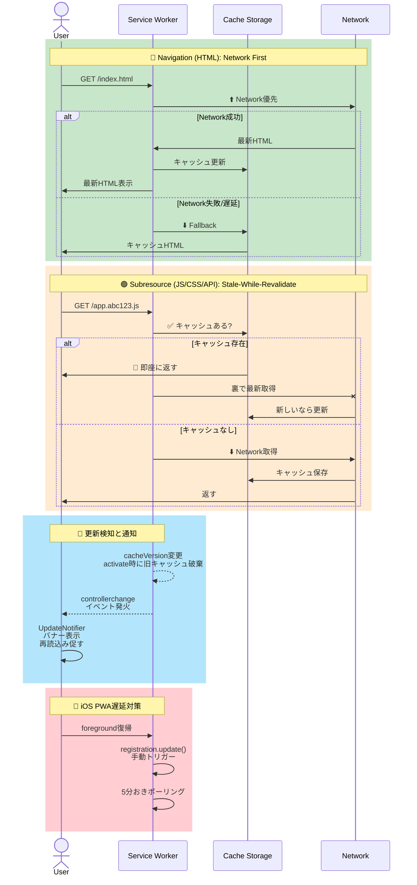

# PWAキャッシュ更新パターン（`shared/pwa/`）

Service Workerでオフライン対応・表示高速化のキャッシュを導入すると、「アプリを更新（デプロイ）したのに、PWA（特にホーム画面に追加したスタンドアロン表示）ではキャッシュされた古いコードが表示され続ける」問題が起きやすい。examinationリポジトリでこの問題に対応する中で得た、実運用で安定しているキャッシュ戦略・更新検知パターンを`shared/pwa/`配下へ切り出し、他のプロダクトでも再利用できるようにしている。

## 提供するファイル

- `shared/pwa/sw.js`: Service Worker本体。ナビゲーション（ページ本体）はNetwork First、それ以外の同一オリジンサブリソース・設定済みAPIホストへのGETはStale-While-Revalidateで扱う。プロダクト固有の値は一切持たない
- `shared/pwa/ServiceWorkerRegistration.jsx`: `sw.js`を登録するReactコンポーネント（`swUrl`未指定時は`/sw.js`）。iOS PWAでの更新チェック遅延に対応するため、フォアグラウンド復帰時・5分おきに`registration.update()`を呼ぶ
- `shared/pwa/UpdateNotifier.jsx`: 新バージョン検知（`controllerchange`イベント）時に再読み込みを促すバナーを表示するReactコンポーネント

3ファイルともプロダクト固有の値を持たないため、そのままsymlinkで共有できる。

## キャッシュ戦略（Network First vs Stale-While-Revalidate）

<details>
<summary>ソースを表示（mermaid記法）</summary>



</details>

戦略の分け方：

1. **ナビゲーション（HTMLページ本体）: Network First**
   - 常に最新HTML取得、ネットワーク失敗時のみキャッシュ fallback
   - デプロイの新しいハッシュ付きJS/CSSを参照できる

2. **サブリソース（JS/CSS/API）: Stale-While-Revalidate**
   - キャッシュを即座に返し、裏側で更新
   - ハッシュ付きJS/CSSは内容変更時に別ファイル名になるため安全

3. **更新検知: controllerchange イベント**
   - 新Service Worker有効化時に発火
   - UpdateNotifierで再読込みバナー表示

4. **iOS PWA対策**
   - フォアグラウンド復帰時の更新確認
   - 5分おきの定期ポーリング（Safari更新遅延対策）

## セットアップ手順

`sw.js`は`importScripts("./sw-config.js")`でプロダクト固有の設定を読み込む前提で書かれている。参照側リポジトリは同じディレクトリへ`sw-config.js`を実ファイルとして用意する。

```js
// 例: app/top/public/sw-config.js（symlinkではなく実ファイル）
self.SW_CONFIG = {
  // キャッシュ戦略・precacheUrls等を変更した際は必ず値を変更し、activate時に
  // 旧キャッシュを確実に破棄させること
  cacheVersion: "v1",
  // インストール時に先読みキャッシュするページ一覧
  precacheUrls: ["/", "/about/"],
  // Stale-While-Revalidateでキャッシュするバックエンド API のホスト名一覧
  apiHostnames: ["xxxxxxxxxx.execute-api.us-east-1.amazonaws.com"],
  // （任意、既定[]）Cookie等の認証セッションに依存し、レスポンスがアカウントごとに
  // 変わる同一オリジンAPIのパスprefix一覧。Cache StorageのキーはURLのみでCookieを
  // 考慮しないため、通常のキャッシュ対象に含めると別アカウントへの切り替え後も
  // 前のアカウントのレスポンスを返し続けてしまう（bamiyanapp/dev-standards#284）。
  // 該当パスはキャッシュ対象から完全に除外し、常にネットワークへ直接流す
  noCacheSameOriginPrefixes: ["/_"],
};
```

次に、参照側リポジトリのルートに`sync-manifest.local.json`を用意し、`shared/pwa/`配下のファイルをリポジトリ自身のディレクトリ構成に合わせてsymlink化する。`sync-manifest.json`（dev-standards本体側）は全参照側リポジトリで共通のパスのみを収録するため、プロダクト固有のディレクトリ構成（例: 独立ビルドの複数フロントエンドアプリを持つ構成）はこちらに書く（詳細は`README.md`「セットアップ」節参照）。

```json
{
  "symlinks": [
    { "source": "shared/pwa/sw.js", "target": "app/top/public/sw.js" },
    { "source": "shared/pwa/ServiceWorkerRegistration.jsx", "target": "app/top/src/components/ServiceWorkerRegistration.jsx" },
    { "source": "shared/pwa/UpdateNotifier.jsx", "target": "app/top/src/components/UpdateNotifier.jsx" }
  ]
}
```

`sw.js`をホストするページ（Service Workerを`/sw.js`として配信する1箇所）だけでなく、同一サイトを構成する複数の独立ビルドアプリそれぞれで`ServiceWorkerRegistration.jsx`・`UpdateNotifier.jsx`を使う場合を考える。アプリの数だけ`symlinks`エントリを追加する（`source`は同じでよい）。`sync-manifest.json`/`sync-manifest.local.json`は同一`source`を複数の`target`へ結びつけることを制限していない。

`node dev-standards/scripts/bootstrap.js`を実行するとsymlinkが作成される。`reusable-ci.yml`の`enable_standards_check: true`を有効にしていれば、CIで`bootstrap.js --check`によりsymlinkの欠落・リンク切れを自動検知できる。

## 各コンポーネントの利用側での組み込み

```jsx
// App.jsx等
import ServiceWorkerRegistration from "./components/ServiceWorkerRegistration.jsx";
import UpdateNotifier from "./components/UpdateNotifier.jsx";

export default function App() {
  return (
    <>
      <ServiceWorkerRegistration />
      <UpdateNotifier />
      {/* ... */}
    </>
  );
}
```

`UpdateNotifier.jsx`は標準構成であるBootstrap 5.3（`alert`/`btn`等）のクラス名を使っている（issue #289）。Bootstrapを使っていないプロダクト（daisyUI構成のexamination等）では、そのままでもクラス名が無視されるだけで機能上は動作するが、見た目を統一したい場合は自プロダクト側のスタイルに合わせて調整すること（このファイル自体はsymlinkのため直接編集できない点に注意）。調整が必要な場合はsymlink化を見送り、コピーして個別管理する。examinationはこの方針で個別コピーへ切り替え済み。

## GitHub Pages等、basePath配下へ配信する場合

`ServiceWorkerRegistration.jsx`は既定で`navigator.serviceWorker.register("/sw.js")`とサイトルート絶対パスを登録する。GitHub Pagesのプロジェクトページ（例: `https://<user>.github.io/<repo>/`）のように、サイトルート以外のbasePath配下へ配信するプロダクトでは注意が必要である。実際に配信される`sw.js`のパスと一致せず404になりService Worker自体が登録されない（`bamiyanapp/hanko-master-kentei`のissue #214で発見）。

このようなプロダクトは`swUrl`propへ実際のパスを渡す。

```jsx
// Viteの場合、import.meta.env.BASE_URL（vite.config.tsのbase設定と連動）を使う
<ServiceWorkerRegistration swUrl={`${import.meta.env.BASE_URL}sw.js`} />
```

`swUrl`省略時は従来どおり`/sw.js`のままのため、サイトルート配信の既存プロダクトへの影響はない。

## 既知の制約・注意点

- `importScripts`はクラシックスクリプトとしてのService Worker（`register("/sw.js")`、`{ type: "module" }`を指定しない場合）でのみ使える。モジュール形式のService Workerを使う場合は`import`文へ書き換える必要がある
- `sw.js`・`sw-config.js`はVite等のビルドツールの`public/`ディレクトリ（処理されず素通しでコピーされる）に置くことを想定している。バンドラーの変換を経由させたい場合は別途検討が必要
- `cacheVersion`は`sw-config.js`側の値であり、`sw.js`の内容自体（dev-standards側）を更新した場合でも、参照側リポジトリが独自に`cacheVersion`を上げない限り古いキャッシュは破棄されない。`sw.js`本体の戦略を変更した際は、更新履歴（`CHANGELOG.md`等）でその旨を明示し、参照側リポジトリでの`cacheVersion`更新を促すこと
