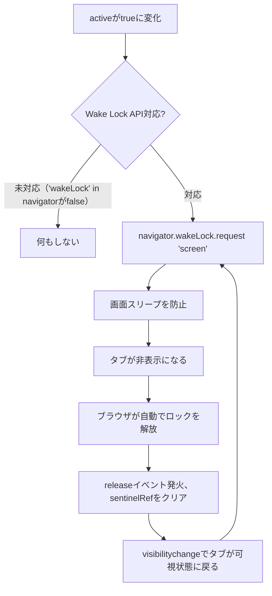

# 共有UIコンポーネント（`shared/ui/`, `shared/pwa/`, `shared/sfx/`, `shared/hooks/`）

複数の独立ビルドフロントエンドアプリで同一サイトを構成するプロダクト（examination等）を対象とする。プロダクト固有の値を持たない、または小さなpropsで汎用化できる横断的UIコンポーネントを`shared/ui/`へ集約する。PWAキャッシュ更新パターン（`shared/pwa/`）・効果音（`shared/sfx/`）・汎用Reactフック（`shared/hooks/`）と同様の扱いである。`sync-manifest.local.json`経由でsymlink共有する。セットアップ手順は`docs/service-worker-update-pattern.md`「セットアップ手順」を参照する（考え方は共通）。

## 提供するコンポーネント

### `shared/ui/common-theme.css`

フレームワーク非依存の共通テーマ（issue #236）。共通フォント（`docs/frontend-ui-conventions.md`）・フェードイン/アウトの共通ユーティリティ（`.fade-in`/`.fade-out`）を提供する。ボタン押下時の軽い触覚的フィードバックも提供する。Bootstrap・Tailwind等どのCSSフレームワークを使うプロダクトでも利用できる。Bootstrap固有のダークモード対応は含まない。それが必要な場合は下記`bootstrap-theme.css`を使う。

利用側のグローバルCSSへ`@import`する。

```css
@import "./common-theme.css";
```

「M PLUS Rounded 1c」フォント自体（Google Fonts等からの読み込み）は利用側の既存の資産管理方針に従う。本ファイルは`font-family`の指定のみ行う。

`.fade-in`/`.fade-out`は**トグル駆動**のユーティリティである。要素をopacity: 0の状態でマウントしておき、その後任意のタイミングでクラスを付与・削除してtransitionさせる仕組みである。トースト通知等、表示⇄非表示を繰り返す用途に向いている。「要素がDOMに挿入された瞬間に1回だけ自動再生したい」（起動時のオープニング演出等）というユースケースを考える。呼び出し側の状態管理（マウント直後はopacity: 0でレンダリングし、次のレンダリングでクラスを付与する等）が別途必要になり、素直には使えない。そのような用途には`@keyframes` + `animation`ベースの独自実装が適する（`uchi-stock/kingyo`の`.app-opening-fade-in`が実例）。両者は解決する問題自体が異なるため、意図的に別実装のままとした。詳細は[uchi-stock/kingyo#140](https://github.com/uchi-stock/kingyo/issues/140)参照。

### `shared/ui/bootstrap-theme.css`

Bootstrap 5.3ベースのアプリ向け共通テーマ（issue #232）。ダークモード（`data-bs-theme="dark"`）対応・Bootstrapボタンコンポーネントのダークモード配色等、Bootstrap固有の部分を提供する。フレームワーク非依存の部分（共通フォント・フェードイン/アウト・ボタン押下時の触覚的フィードバック）は上記`common-theme.css`を`@import`している。このため**本ファイルを利用する場合は`common-theme.css`も同じディレクトリへ併せてsymlinkすること**（`@import`の相対パス解決に必要）。かるた札の意匠等プロダクト固有のスタイルは含まない。

利用側でBootstrap 5.3本体（CDN・npmいずれでも可）を読み込み、以下のようにグローバルCSSへ`@import`する。

```css
@import "./bootstrap-theme.css";
```

ダークモードの切り替え（`<html data-bs-theme="dark">`等の付与・トグルUI）自体は利用側アプリの責務であり、本ファイルはCSS側の追従のみを担う。

### `shared/ui/NavigationOverlay.jsx`

SPAクライアントサイドルーティングを導入しない全ページ遷移の設計で、リンククリックから実際の画面遷移までの間、読み込み中であることが分かるオーバーレイを表示する。プロダクト固有の値は無い。ただし利用側のCSSに、JSがclickイベントでvisibleクラスを付け外しする状態遷移を表現する以下のルールが必要（Bootstrapのユーティリティだけでは表現できないため）。

```css
.nav-overlay {
  display: none;
}

.nav-overlay.visible {
  display: flex;
}
```

### `shared/ui/BackToTop.jsx`

他ページへ戻るリンク。`href`（既定`"/"`）・`label`（既定`"← トップに戻る"`）をpropsで受け取る。

```jsx
<BackToTop href="/" label="← トップに戻る" />
```

### `shared/ui/SpeculationRules.jsx`

Speculation Rules API（Chrome）による他ページのprefetch。`urls`（先読み対象のURL一覧）をpropsで受け取る。現在ページ自身は自動的に除外する。データセーバー有効時・低速回線時は先読みしない。

```jsx
<SpeculationRules urls={["/", "/about/"]} />
```

### `shared/pwa/BackendCacheWarmer.jsx`

初回訪問時にバックエンドAPIをバックグラウンドで先読みし、Service Worker（`shared/pwa/sw.js`）のキャッシュを温めておく。`endpoints`（先読みするURL一覧）・`getAuthToken`（認証トークンを取得する非同期関数、任意）をpropsで受け取る。`warmedFlagKey`（`sessionStorage`のフラグキー、プロダクトごとに固有の値にすること）も同様に受け取る。

```jsx
<BackendCacheWarmer
  endpoints={["https://api.example.com/questions"]}
  getAuthToken={async () => {
    const res = await fetch("/_voice-token", { method: "POST" });
    if (!res.ok) return undefined;
    const { token } = await res.json();
    return token;
  }}
  warmedFlagKey="myapp-backend-cache-warmed"
/>
```

### `shared/ui/resizeTextareaToFitContent.js`

textareaを入力内容に応じて高さ可変にする関数。フックではなくプレーンな関数で、`ref`コールバック（マウント時・既存内容の初期表示）と`onInput`ハンドラ（入力のたび）の両方に同じ関数をそのまま渡せる。

```jsx
import resizeTextareaToFitContent from "./components/resizeTextareaToFitContent.js";

<textarea
  value={value}
  onChange={(e) => setValue(e.target.value)}
  onInput={(e) => resizeTextareaToFitContent(e.target)}
  ref={resizeTextareaToFitContent}
  className="form-control"
  style={{ resize: "none", overflow: "hidden" }}
/>
```

`resize: "none"`・`overflow: "hidden"`をtextarea自体に指定する。ブラウザ標準のリサイズハンドル・スクロールバーを出さないようにすること（Bootstrapに`resize-none`等のユーティリティクラスは無いため、インラインスタイルで指定する）。

### `shared/ui/ShareButton.jsx`

現在のページをQRコードで表示し、URLをワンタップコピーできるボタン＋モーダル。スマートフォンオンリーの利用環境での画面共有を想定。

**Bootstrap 5.3クラス実装（issue #328・PR #349）**。daisyUI（Tailwind）構成のプロダクトでは無スタイルになる。symlinkで共有せず、ロジックのみ流用してクラス名をdaisyUI用に書き換えたローカルコピーを持つこと。実例はCamp-Stock `frontend/src/components/ShareButton.jsx`（issue #393）である。特定のCSSフレームワークのクラスをハードコードする共有コンポーネントには制約がある。異なるフレームワークの消費者に同時対応できないという制約である。そのため、新規にこの種のコンポーネントを追加・変更する際は`docs/consumer-repositories.md`で全消費側のCSSフレームワークを確認すること。

```jsx
<ShareButton label="このページを共有" />
```

**依存関係**: `qrcode.react`を利用側の`package.json`へ追加する必要がある（dev-standards側では強制できない）。

**Viteの`resolve.preserveSymlinks`が必須**: `ShareButton.jsx`のようにnpmパッケージをimportするコンポーネントをsymlink経由で共有する場合を考える。Viteは既定でシンボリックリンクの実体パス（dev-standards配下）を起点に`node_modules`を探索する。このため利用側にインストール済みの`qrcode.react`を見つけられずビルドエラーになる。利用側の`vite.config.js`へ以下を追加すること。PRECACHE等プロダクト固有値を持たないコンポーネント同士でも、npmパッケージに依存する共有コンポーネントを1つでも導入する場合はアプリ全体でこの設定が必要になる。

```js
export default defineConfig({
  // ...
  resolve: {
    preserveSymlinks: true,
  },
});
```

### `shared/ui/getAppVersionDefine.js`・`shared/ui/formatBuildTime.js`

`docs/frontend-ui-conventions.md`「トップページの必須構成」（バージョン・更新日時の表示）を実装するための2つの関数。`getAppVersionDefine.js`はNode.js側（`vite.config.js`）で動く点が他の`shared/ui/`コンポーネントと異なる。ブラウザで動くReactコンポーネントではない。

`vite.config.js`:

```js
import getAppVersionDefine from "./getAppVersionDefine.js"; // symlink

export default defineConfig({
  define: {
    ...getAppVersionDefine(new URL("../package.json", import.meta.url)),
  },
});
```

`package.json`のパスは呼び出し側で指定する。semantic-releaseがバージョンを更新するリポジトリルートの`package.json`か、アプリ自身の`package.json`かはプロダクトの構成による。`getAppVersionDefine.js`は`vite.config.js`から直接importするNode.js側のファイルである。そのため、他の`shared/ui/`コンポーネント（`src/components/`配下）とは異なる場所に置く。`vite.config.js`と同じディレクトリへsymlinkすること。

アプリ側のコンポーネントの実装例を以下に示す（表示位置・マークアップはプロダクトごとに異なるため、この部分は共有しない）。

```jsx
import formatBuildTime from "./formatBuildTime.js"; // symlink

function AppHeader() {
  return (
    <p>
      v{__APP_VERSION__} / 更新日時: {formatBuildTime(__APP_BUILD_TIME__)}
    </p>
  );
}
```

### `shared/sfx/wadodon.mp3`

太鼓のイントロ音（issue #786）。クイズ・ゲーム系プロダクトで「出題の合図」等に使える汎用的な効果音で、karuta（`bamiyanapp/karuta`）から切り出したもの。プロダクト固有の値は無いプレーンな音声ファイルのため、propsやAPIは無く、利用側で`new Audio("wadodon.mp3")`のように直接参照するだけでよい。

Viteの`public/`ディレクトリ配下へsymlinkすることを想定している（`public/`配下はビルド時に加工されずそのままコピーされるため、`base`設定に関わらず相対パスでの参照が崩れない）。iOS Safari等の自動再生ポリシー対策（ユーザー操作の中で一度再生してから使い回す）が必要な場合を考える。karutaの`frontend/src/utils/audioUnlock.js`の実装を参考にする。

### `shared/sfx/click.mp3`・`shared/sfx/shock.mp3`

決定/クリック音（`click.mp3`）と、不正解・失敗・警告を強く印象付けるブザー/アラート音（`shock.mp3`）（issue #314）。Electric-Chair-Arena（`bamiyanapp/Electric-Chair-Arena`）から切り出したもの。`click.mp3`は椅子選択・クイズの回答決定・メニュー選択等の「選択を確定した」汎用UIフィードバック音である。`shock.mp3`はクイズの不正解演出・ゲームオーバー演出等の「失敗・警告」を印象付けたい場面で使える。いずれもプロダクト固有の値は無いプレーンな音声ファイルのため、propsやAPIは無く、利用側で`new Audio("click.mp3")`のように直接参照するだけでよい。

Next.jsの`public/`ディレクトリもVite同様、ビルド時に加工されずそのままコピーされるため、同じ考え方でsymlinkできる。

### `shared/sfx/success.mp3` / `shared/sfx/failure.mp3`

操作の成功・失敗を通知する汎用的な効果音（`uchi-stock/kingyo`issue #144〜由来の「捕獲成功」「掬い失敗」の音を、プロダクト固有の演出を含まない部分として切り出したもの）。ゲーム・ツール系プロダクトで、何らかの操作の成否をフィードバックする場面に広く使える。`shock.mp3`（不正解・警告を強く印象付けるブザー音）に対し、こちらはより穏やかな「掬い損ねた」程度の一般的なミス演出向け。

```jsx
import successSoundUrl from './assets/sounds/success.mp3'
import failureSoundUrl from './assets/sounds/failure.mp3'

const playSuccessSound = usePlaySound(successSoundUrl)
const playFailureSound = usePlaySound(failureSoundUrl)
```

（`usePlaySound`のようなHTMLAudioElement再生用フック自体は本ドキュメントの対象外。利用側で用意する）

プロダクト固有の追加演出（例: kingyoの「ポイが破れる」効果音）は対象外で、各プロダクト側で個別に用意する。

### `shared/sfx/success-2.mp3`

`success.mp3`の別バリエーション（issue #316）。Electric-Chair-Arenaの「セーフ」演出音から切り出したもの。役割は`success.mp3`と同じ「操作の成功を通知する汎用音」だが、音自体が別物のため、片方へ統合せず選べるバリエーションとして追加した。プロダクトの雰囲気に合わせて`success.mp3`・`success-2.mp3`のどちらかを選ぶ。`failure.mp3`との組み合わせは利用側の判断に委ねる（`success-2.mp3`用の専用`failure`バリエーションは無い）。

### `shared/ui/ErrorBoundary.jsx`

レンダリング中の未捕捉例外で画面が真っ白なまま操作不能になる事象への対策となるReact Error Boundary。`reportUrl`（任意）propを渡すと、捕捉した例外情報をサーバーサイドのログへ残すエンドポイントへfire-and-forgetで送信する。対になる`shared/lambda/clientErrorReporting.js`と合わせ、詳細は`docs/client-error-reporting-pattern.md`を参照。

```jsx
<ErrorBoundary reportUrl={`${API_BASE_URL}/report-client-error`}>
  <App />
</ErrorBoundary>
```

### `shared/hooks/useLocalStorageState.js`

`localStorage`とReact stateを双方向同期する汎用hook（issue #559）。karuta（`bamiyanapp/karuta`）から切り出したもの。キー名・値の型はすべて呼び出し側から注入され、プロダクト固有のロジックは含まない。`parse`/`format`関数（任意）を渡すと文字列以外の値も扱える。

```jsx
import { useLocalStorageState } from "./hooks/useLocalStorageState.js";

const [volume, setVolume] = useLocalStorageState(
  "myapp-volume",
  1,
  (v) => Number(v),
  (v) => String(v)
);
```

`parse`/`format`を省略すると素の文字列としてそのまま扱う。

### `shared/hooks/useSessionStorageState.js`

`sessionStorage`とReact stateをJSONシリアライズで双方向同期する汎用hook（issue #559）。karutaから切り出したもの。オブジェクト・配列等、JSONで表現できる値をそのまま渡せる。

```jsx
import { useSessionStorageState } from "./hooks/useSessionStorageState.js";

const [answers, setAnswers] = useSessionStorageState("myapp-answers", []);
```

読み書きに失敗した場合（プライベートブラウジング等でのストレージアクセス不可を含む）は`defaultValue`にフォールバックする。

### `shared/hooks/useValueChange.js`

「前回レンダー時の値と比較し、変わっていれば副作用の無いstate更新を同期的に行う」パターンの共通化hook（issue #560）。karutaから切り出したもの。`useEffect`内での無条件`setState`は`react-hooks/set-state-in-effect`ルールに抵触する。これを避けるため、Reactが推奨する「レンダー中のstate調整」の代替手段にあたる。外部キーの変化・接続状態の監視等、値の変化検知一般に同型で繰り返し現れる。

```jsx
import { useValueChange } from "./hooks/useValueChange.js";

useValueChange(connectionStatus, (current, previous) => {
  setLastStatusChangeAt(Date.now());
});
```

`onChange`は副作用を伴わない同期的なstate更新のみを行うこと（レンダー中に呼ばれるため、fetch等の非同期処理やDOM操作は別途`useEffect`に書く）。`value`自体の導出ロジック（前回値への依存を含む複雑な分岐等）はこのhookの対象外とし、呼び出し側に委ねる。

### `shared/hooks/useWakeLock.js`

`active`がtrueの間、画面のスリープを防止するhook（issue #561）。karutaから切り出したもの。Wake Lock API未対応環境（iOS Safari等）でも例外を投げず何もしない（フィーチャー検出）。「開発環境の制約（スマホオンリー）」で述べているiOS Safari非対応APIへの対策の実装例。タブ非表示による自動解放後は、`visibilitychange`イベントで再取得する。

```jsx
useWakeLock(isPlayingQuiz);
```




### `sync-manifest.local.json`への追加例

```json
{
  "symlinks": [
    { "source": "shared/ui/common-theme.css", "target": "app/top/src/common-theme.css" },
    { "source": "shared/ui/bootstrap-theme.css", "target": "app/top/src/bootstrap-theme.css" },
    { "source": "shared/ui/NavigationOverlay.jsx", "target": "app/top/src/components/NavigationOverlay.jsx" },
    { "source": "shared/ui/BackToTop.jsx", "target": "app/top/src/components/BackToTop.jsx" },
    { "source": "shared/ui/SpeculationRules.jsx", "target": "app/top/src/components/SpeculationRules.jsx" },
    { "source": "shared/pwa/BackendCacheWarmer.jsx", "target": "app/top/src/components/BackendCacheWarmer.jsx" },
    { "source": "shared/ui/ShareButton.jsx", "target": "app/top/src/components/ShareButton.jsx" },
    { "source": "shared/ui/resizeTextareaToFitContent.js", "target": "app/top/src/components/resizeTextareaToFitContent.js" },
    { "source": "shared/ui/getAppVersionDefine.js", "target": "app/top/getAppVersionDefine.js" },
    { "source": "shared/ui/formatBuildTime.js", "target": "app/top/src/components/formatBuildTime.js" },
    { "source": "shared/ui/ErrorBoundary.jsx", "target": "app/top/src/components/ErrorBoundary.jsx" },
    { "source": "shared/hooks/useLocalStorageState.js", "target": "app/top/src/hooks/useLocalStorageState.js" },
    { "source": "shared/hooks/useSessionStorageState.js", "target": "app/top/src/hooks/useSessionStorageState.js" },
    { "source": "shared/hooks/useValueChange.js", "target": "app/top/src/hooks/useValueChange.js" },
    { "source": "shared/hooks/useWakeLock.js", "target": "app/top/src/hooks/useWakeLock.js" },
    { "source": "shared/sfx/wadodon.mp3", "target": "app/top/public/wadodon.mp3" },
    { "source": "shared/sfx/click.mp3", "target": "app/top/public/click.mp3" },
    { "source": "shared/sfx/shock.mp3", "target": "app/top/public/shock.mp3" },
    { "source": "shared/sfx/success.mp3", "target": "app/top/src/assets/sounds/success.mp3" },
    { "source": "shared/sfx/failure.mp3", "target": "app/top/src/assets/sounds/failure.mp3" },
    { "source": "shared/sfx/success-2.mp3", "target": "app/top/public/success.mp3" }
  ]
}
```

複数の独立ビルドアプリで同一コンポーネントを使う場合は、アプリの数だけエントリを追加する（`source`は同じでよい）。
