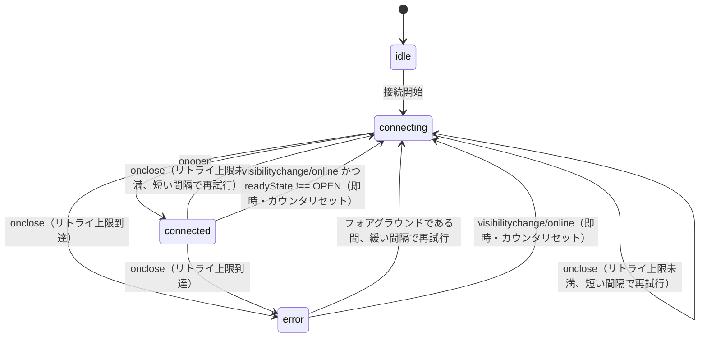

# WebSocketクライアント再接続エンジンの設計パターン

ブラウザから直接WebSocketへ接続するクライアント（チャット・リアルタイム協調編集・対戦ゲーム等）で繰り返し必要になる、「接続を維持し続ける」ための設計知見をまとめる。karuta（[bamiyanapp/karuta](https://github.com/bamiyanapp/karuta)）のクイズ大会モードWebSocketクライアントから、業務メッセージの内容（`type`ごとのディスパッチ処理等）を除いた、**接続管理そのものの設計判断**を切り出したもの。

コードそのものの共有（symlink化）ではなく設計知見の共有が目的のため、`docs/serverless-spa-pattern.md`と同様に実装は参照側（karuta）を見る方式を取る。

## 解決する問題

モバイルブラウザでの利用を前提にすると、単純な「切断されたら即座に再接続する」実装では不十分になる。

- スマートフォンの画面ロック・アプリのバックグラウンド化により、ブラウザがタイマー・ネットワーク処理をスロットリングする。復帰時には接続が切れたままになっていることがある
- 再接続を無条件・無制限に繰り返すと、サーバー側の障害時にクライアントが際限なくリクエストを送り続けてしまう
- 接続確立前（初回接続のサーバー側コールドスタート・WSハンドシェイク中、または再接続中）に呼ばれた送信は、単純な実装では黙って失われる
- 定期的な自己修復ポーリング（後述）を固定間隔`setInterval`で行うと、同一ルーム・チャンネルの全クライアントが同時刻に送信し、サーバー負荷が偏る

## 設計知見

### 1. 再接続は「短い固定間隔での上限付きリトライ」→「緩い間隔でのフォアグラウンド限定リトライ」の2段構え

いきなり長時間隔でリトライすると復帰が遅く感じられ、かといって無制限に短間隔でリトライし続けるとサーバー障害時に負荷をかけ続けてしまう。以下の2段階に分ける。

1. 切断のたびに短い固定間隔（例: 3秒）で再接続を試み、上限回数（例: 5回、合計15秒程度）に達したら`error`状態にする
2. `error`状態に達した後も、画面がフォアグラウンド（`document.visibilityState === "visible"`）である間だけ、より緩い間隔（例: 15秒）でリトライを続ける。バックグラウンド中は無駄なリトライをせず、フォアグラウンド復帰時（下記2.）の即時再接続に委ねる

### 2. `visibilitychange`/`online`イベント契機の即時再接続

画面ロック解除・アプリのフォアグラウンド復帰（`visibilitychange`）、およびオフラインからの復帰（`online`）を検知したら、現在の接続が生きていなければ（`readyState !== OPEN`）、リトライ回数をカウンタごとリセットして即座に再接続する。この「即時再接続」関数は、手動の再接続ボタンからも共用できる汎用関数として実装しておくと、ユーザーが自発的に回復を試せるUIにもそのまま使い回せる。

### 3. フォアグラウンド限定・ジッター付きの自己修復keep-alive

プッシュ型のブロードキャストのみに頼ると、個別の送信が何らかの理由で欠落した場合にクライアントの状態が復旧しないままになる。一定間隔で「現在の状態を再送してほしい」という同期リクエストを送る保険的なポーリングを設けるとよい。

- 固定間隔の`setInterval`ではなく、送信のたびにランダムなジッターを加えて次回をスケジュールし直す`setTimeout`チェーンにする。これにより同一ルーム・チャンネルの全クライアントが同時刻に送信して負荷が偏るのを防ぐ
- タブが非表示（`document.hidden`）の間は送信自体をスキップし、コストを抑える。フォアグラウンド復帰時は上記2.のイベントハンドラ側で即座に1回同期させる

保険としての位置づけである以上、間隔は短くしすぎない（低頻度で十分）。参加者数・接続数に比例して定常的に発生するサーバー側の処理コストを抑える観点でも、間隔は実測しながら調整する。

### 4. 接続確立前に呼ばれた送信を再送する「pending値」パターン

送信用の関数（例: `broadcastState(state)`）は、渡された値を`ref`に保持しておき、`readyState === OPEN`であればその場で送信、そうでなければ何もしない（値はrefに残る）ようにする。接続の`open`イベントのたびに、この`ref`の値が`null`でなければ送り直す。

これにより、初回接続のハンドシェイク中や再接続中に呼ばれた送信が黙って失われることなく、接続確立後に自動的に反映される。

### 5. 最新コールバックをrefで保持する設計

呼び出し側から渡されるコールバック（メッセージ受信時のハンドラ等）は、接続を確立する`useEffect`（または相当の初期化処理）の依存配列に含めると、コールバックの参照が変わるたびに不要な再接続が発生してしまう。コールバックは専用の`ref`に常に最新値を反映しておき、接続確立処理自体はURLや認証情報等、実際に再接続が必要な値にのみ依存させる。

## 状態遷移

## 実例

karuta（`bamiyanapp/karuta`）の`frontend/src/hooks/useQuizRoomSync.js`が本パターンの完全な実装例。特に以下の箇所を参照する。

- `RECONNECT_DELAY_MS`・`MAX_RECONNECT_ATTEMPTS`・`ERROR_RETRY_INTERVAL_MS`（定数、上記1.）
- `scheduleNextSyncPoll`（上記3.のジッター付きポーリング）
- `pendingStateRef`・`pendingNameRef`（上記4.のpending値パターン）
- `onStateRef`等の各種`onXxxRef`（上記5.の最新コールバック保持）
- `forceReconnect`と、それを呼び出す`visibilitychange`/`online`ハンドラ（上記2.）

業務メッセージの内容（`type`ごとのディスパッチ処理を担う`QUIZ_ROOM_MESSAGE_HANDLERS`・`dispatchQuizRoomMessage`等）は本パターンの対象外で、プロダクトごとに個別に実装する。
